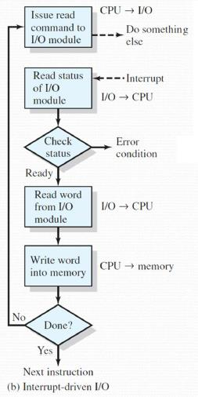
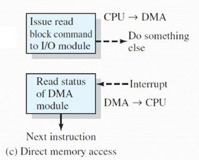

# TEMA 1. SISTEMA DE CÓMPUTO

### Índice
- [1. Componentes de un sistema de cómputo](#1-componentes-de-un-sistema-de-cómputo)
	- [1.1 Definiciones básicas](#11-definiciones-básicas)
- [2. Capa Hardware](#2-capa-hardware)
	- [2.1. Estructura de un ordenador](#21-estructura-de-un-ordenador)
	- [2.2. Elementos básicos](#22-elementos-básicos)
	- [2.3. Registros del procesador](#23-registros-del-procesador)
	- [2.4. Ejecución de instrucciones. Tipos de instrucciones](#24-ejecución-de-instrucciones-tipos-de-instrucciones)
	- [2.5. Técnicas de Comunicación de E/S](#25-técnicas-de-comunicación-de-es)
	- [2.6. Excepciones](#26-excepciones)
	- [2.7. Protección del procesador](#27-protección-del-procesador)
	- [2.8. Protección de los dispositivos de E/S](#28-protección-de-los-dispositivos-de-es)
	- [2.9. Protección de memoria](#29-protección-de-memoria)
- [3. El sistema operativo](#3-el-sistema-operativo)
	- [3.1. El SO como interfaz Usuario/Computadora](#31-el-so-como-interfaz-usuario-computadora)
	- [3.2. El SO como administrador de recursos](#32-el-so-como-administrador-de-recursos)
- [4. Utilidades del Sistema](#4-utilidades-del-sistema)
	- [4.1 Programas del servicio del SO](#41-programas-del-servicio-del-so)
	- [4.2 Herramientas generales](#42-herramientas-generales)
- [Bibliografía](#bibliografía)

### 1. Componentes de un Sistema de Cómputo

#### 1.1 Definiciones básicas

- **Informática** (*infor*mación y auto*mática*): conjunto de
    conocimientos científicos y técnicas que hacen posible el
    tratamiento automático de la información por medio de ordenadores.

- **Computador**: máquina capaz de aceptar unos datos de entrada,
    efectuar con ellos operaciones lógicas y aritméticas, y proporcionar
    la información resultante a través de un medio de salida; todo ello
    sin intervención de un operador humano y bajo el control de un
    programa de instrucciones previamente almacenado en el
    propio computador.

- **Bit** (*Bi*nari Digi*t*): es una posición o variable que toma el
    valor 0 ó 1 y es la unidad mínima de información. Además,
    codifica información.

- **Instrucción u orden**: conjunto de símbolos insertados en una
    secuencia estructurada o específica que el procesador interpreta
    y ejecuta.

- **Programa**: conjunto ordenado de instrucciones que dan a la
    computadora indicándole las operaciones o tareas que desea
    que realice.

- **Lenguaje de programación**: lenguaje formal diseñado para
    describir el conjunto de acciones consecutivas que un equipo
    debe ejecutar.

- **Lenguaje máquina**: lenguaje cuyas instrucciones interpretan los
    circuitos eléctricos de la unidad de control.

- **Hardware**: conjunto de componentes de componentes que integran
    la parte material de un computador; conjunto de circuitos
    eléctricos, cables...

- **Firmware**: bloque de instrucciones de máquina para propósitos
    específicos grabado en una memoria, normalmente de lectura/escritura
    que establece la lógica de más bajo nivel que controla los circuitos
    electrónicos de un dispositivo de cualquier tipo.

- **Software** (soporte lógico): conjunto de programas,
    instrucciones y reglas informáticas que permiten ejecutar distintas
    tareas en una computadora.

- **Sistema informático**: es un sistema que permite almacenar y
    procesar información; es el conjunto de partes interrelacionadas:
    hardware, software y personal informático.

- **Dato**: conjunto de símbolos utilizados para expresar o
    representar un valor numérico, un hecho, un objeto o una idea; en la
    forma adecuada para ser objeto de tratamiento. Es un elemento
    de información.

- **Byte**: unidad mínima para direccionar.

1 Byte = 8 bits

Bytes           | bits
----------------| -------------
1 KB = 2^10 B   | 1 Kb = 2^10 b
1 MB = 2^10 KB  | 1 Mb = 2^20 b
1 GB = 2^10 MB  | 1 Gb = 2^30 b
1 TB = 2^10 GB  | 1 Tb = 2^40 b
1 PB = 2^10 TB  | 1 Pb = 2^50 b

### 2. Capa Hardware

#### 2.1 Estructura de un Ordenador

#### 2.2 Elementos básicos

-   **Procesador**: controla el funcionamiento del computador y
    realiza funciones de procesamiento de datos. Cuando sólo hay un
    procesador, se denomina **CPU** (Central Processing Unit). Una de
    sus funciones es el intercambio de datos, para ello se compone de
    registros internos:

    -   **Registro de dirección de memoria (RDIM):** especifica la
        dirección de memoria de la siguiente lectura o escritura.

    -   **Registro de datos de memoria (RDAM):** contiene los datos
        leídos o que van a ser escritos en memoria.

    -   **Registro de dirección de E/S (RDI E/S):** especifica
        dispositivo de E/S.

    -   **Registro de datos E/S (RDA E/S):** permite intercambio de
        datos entre dispositivos E/S y procesador.

-   **Memoria principal/real/primaria**: conjunto de posiciones
    definidas mediante direcciones secuenciales que contiene un patrón
    de bits interpretable como instrucción o dato. Es volátil.

-   **Módulo de E/S:** transfiere datos entre dispositivos externos,
    memoria y procesador. Contiene buffers (zonas de almacenamiento
    internas que mantienen temporalmente los datos hasta que se
    puedan enviar).

-   **Bus de sistema:** proporciona comunicación entre procesadores,
    memoria principal y módulos de E/S.

#### 2.3 Registros del Procesador

-   **Registros visibles para el usuario/programador**: permiten al
    programador en lenguaje máquina o en ensamblador minimizar las
    referencias a memoria principal optimizando el uso de registros.
    Tipos:

    -   **Registros de datos**: de propósito general con cualquier
        instrucción de la máquina que realice operaciones con datos
        aunque hay restricciones.

    -   **Registros de dirección**: contienen direcciones de memoria
        principal de datos e instrucciones, o una parte de la
        dirección que se utiliza en el cálculo de la dirección
        efectiva o completa. Por ejemplo:

        -   **Registro índice**: el direccionamiento indexado implica
            sumar un índice a un valor de base para obtener una
            dirección efectiva.

        -   **Puntero de segmento**: la memoria se divide en
            segmentos, que son bloques de palabras de
            longitud variable.

        -   **Puntero de pila**: si hay direccionamiento de pila
            visible para el usuario, hay un registro dedicado que
            apunta a la cima de la pila. Se puede apilar y extraer.

        - 

        - **Registros de control y estado**: usados por el procesador para 				controlar su operación y por rutinasprivilegiadas del sistema 				operativo para controlar la ejecución del programa. Son esenciales 				para la ejecución de instrucciones:

    -   **RDIRM**.

    -   **RDAM**.

    -   **RDIE/S**.

    -   **RDAE/S**.

    -   **Contador de programa (PC)**: contiene la dirección de la
        próxima instrucción que se leerá de la memoria.

    -   **Registro de instrucción (IR)**: contiene la última
        instrucción leída.

    -   **Puntero de pila (SP).**

    -   **Registro de estado (bits informativos)**.

    -   **Palabra de estado del programa (PWS)**: registro o conjunto
        de registros que contienen información del estado del programa
        y códigos de condición. Los **códigos de condición** también
        llamados indicadores son bits asignados por el hardware del
        procesador teniendo en cuenta el resultado de operaciones.

### 2.4 Ejecución de instrucciones. Tipos de instrucciones

Un programa consta de un conjunto de instrucciones
almacenadas en memoria. Procesar una instrucción consta de dos pasos:

1.  El procesador **lee** (busca) instrucciones de la memoria, una
    cada vez.

2.  El procesador **ejecuta** cada instrucción.

Se denomina **ciclo de instrucción** al procesamiento requerido por una
única instrucción.

La ejecución de un programa consiste en repetir el proceso de búsqueda y
ejecución de instrucciones.

Proceso a seguir:

1.  Se **lee** la instrucción cuya dirección está en el PC.

2.  Se **incrementa** el PC en una unidad.

3.  Se **ejecuta** la instrucción.

La ejecución del programa se **detiene** sólo si se apaga la máquina, se
produce un error irrecuperable o se ejecuta una instrucción del programa
que para el procesador.

**Tipos** de instrucciones:

-   **Procesador-memoria**: transferencia de datos desde el procesador
    a la memoria o viceversa.

-   **Procesador-E/S:** se envían datos a un dispositivo periférico o
    se reciben desde el mismo, transfiriéndolos entre el procesador y un
    módulo de E/S.

-   **Procesamiento de datos:** el procesador realiza operaciones
    artimético-lógicas sobre los datos.

-   **Control**: una instrucción puede especificar que se va a alterar
    la secuencia de ejecución.

### 2.5 Técnicas de Comunicación de E/S

Se pueden intercambiar datos directamente
entre un módulo de E/S y el procesador. Hay tres **técnicas** para
llevarlo a cabo:

-   **E/S programada:** el procesador encuentra una instrucción con
    la E/S. Se genera un mandato al módulo de E/S apropiado.

 El procesador adopta un papel activo mientras se atiende la
 instrucción de E/S y comprueba periódicamente le estado de ejecución
 del módulo de E/S hasta que ha finalizado la operación.

> PROBLEMA: el procesador pasa mucho tiempo esperando la finalización
 del módulo de E/S y el sistema se degrada gravemente.

> SOLUCIÓN: mientras se atiende al módulo de E/S, se intenta que el
 procesador pueda continuar con trabajo útil.

-   **E/S dirigida de interrupciones:** evento que interrumpe el flujo
    normal de ejecución y que está producido por un elemento externo
    al procesador. Es un evento asíncrono.

> PROBLEMA: en transferencias considerables de memoria a dispositivo o
 viceversa conlleva un uso excesivo del procesador.

> SOLUCIÓN: Acceso Directo a Memoria. En un solo mandato se genera todo
 lo necesario para realizas la transferencia de información de memoria
 al dispositivo o viceversa.

 **Ciclo** de instrucción con interrupciones:

 Tratamiento de interrupciones **vectorizadas**:

-   **Acceso Directo a Memoria (Direct Memory Access, DMA):**
    realizada por un módulo separado conectado en el bus del sistema o
    incluida en un módulo de E/S. Útil cuando el procesador desea leer o
    escribir un bloque de datos.

### 2.6 Excepciones

Una excepción es un **evento inesperado** generado por alguna condición
que ocurre durante la ejecución de una instrucción (ejemplo:
desbordamiento aritmético, dirección inválida, instrucción
privilegiada…). Es un evento **síncrono**.

### 2.7 Protección del procesador

Funcionamiento en Modo Dual. ¿Qué ocurre si un programa accede a la
memoria donde se alojan los vectores de interrupciones? ¿Qué pasa si las
modifica? El procesador dispone de diferentes **modos de ejecución** de
instrucciones:

-   **Instrucciones privilegiadas (modo supervisor/kernel):** su
    ejecución puede interferir en la ejecución de un programa cualquiera
    o programa del SO (ejemplo, escribir en el puerto de
    un dispositivo).

-   **Instrucciones no privilegiadas (modo usuario):** su ejecución no
    presenta ningún problema de seguridad para el resto de programas
    (ejemplo, incrementar un contador).

### 2.8 Protección de los dispositivos de E/S

Es fundamental para evitar que unos usuarios puedan acceder
indiscriminadamente a los periféricos (sobre todo los de
almacenamiento).

Para conseguirlo, las instrucciones máquina para acceso a los
dispositivos de E/S no pueden ejecutarse en modo usuario, son
privilegiadas. Cualquier acceso a los dispositivos desde un programa de
usuario se hará mediante peticiones al SO.

### 2.9 Protección de memoria

Cada programa en ejecución requiere de un espacio de memoria.

Por lo que hay que proteger la zona de memoria asignada y la memoria en
la que está el código del SO (tabla de vectores de interrupción, rutinas
de tratamiento de cada interrupción).

## 3. El Sistema Operativo

Es un programa o conjunto de programas que controla la ejecución de los
programas de aplicación y que actúa como interfaz entre el usuario de
una computadora y el hardware de la misma. Sus objetivos son:

-   **Facilidad y comodidad** en el uso.

-   **Eficiencia**: existen más programas que recursos. Hay que repartir
    los recursos entre los programas.

-   Capacidad para **evolucionar** debido a las siguientes razones:

    -   Actualizaciones del hardware y nuevos tipos de hardware.

    -   Mejorar y/o aportar nuevos servicios.

    -   Resolución de fallos.

### 3.1 El SO como interfaz Usuario/Computadora

Presenta al usuario una máquina abstracta más fácil de programar que el
hardware subyacente:

-   Oculta la complejidad del hardware.

-   Da tratamiento homogéneo a diferentes objetos de bajo nivel
    (archivos, procesos, dispositivos…).

Una aplicación se puede expresar en un lenguaje de programación y la
desarrolla un programador de aplicaciones.

Es más fácil programar las aplicaciones en lenguajes de alto nivel que
en el lenguaje máquina que entiende el hardware.

Un SO proporciona utilidades en las siguientes áreas:

-   **Desarrollo de programas**: editores de texto, compiladores,
    depuradores de programas.

-   **Ejecución de programas**: cargador de programas y ejecución
    de éstos.

-   **Acceso a dispositivos de E/S:** cada dispositivo requiere su
    propio conjunto de instrucciones.

-   **Acceso al sistema:** en sistemas compartidos o públicos, el SO
    controla el acceso y uso de los recursos del sistema: Shell,
    Interfaz gráfico.

-   **Detección y respuesta a errores**: tratamiento a nivel software
    y hardware.

-   **Contabilidad**: estadísticas de uso de los recursos y medida del
    rendimiento del sistema.

### 3.2 El SO como administrador de recursos

Un computador es un conjunto de recursos y el SO debe gestionarlos y
para ello posee un mecanismo de control que cubre dos aspectos:

-   Las **funciones** del SO actúan de la misma forma que el resto del
    software, es decir, son programas ejecutados por el procesador.

-   El **SO** frecuentemente cede el control y depende del procesador
    para volver a retomarlo.

Por lo tanto:

-   El SO dirige al **procesador** en el uso de los recursos del sistema
    y en la temporización de la ejecución de otros programas.

-   Una parte del **código** del SO se encuentra cargado en la memoria
    principal (kernel y, a veces, otras partes del SO que se
    estén usando). El resto de la memoria está ocupada por programas y
    datos de usuario.

-   La asignación de la **memoria principal** la realizan conjuntamente
    el SO y el hardware de gestión de memoria del procesador.

-   El SO decide cuándo un programa en ejecución puede usar un
    dispositivo de E/S y también el acceso y uso de los ficheros. El
    procesador es también un recurso.

## 4. Utilidades del Sistema

### 4.1 Programas del servicio del SO

Se trata de un conjunto de programas de servicio que, en cierta medida,
pueden considerarse como una ampliación del SO:

-   **Compactación de discos**: para poder acceder a ellos
    más rápidamente.

-   **Compresión de datos**: utilizando algoritmos de compresión.

-   **Gestión de comunicaciones**: a través de tarjeta de red o
    de módem.

-   **Visualizadores y navegadores de internet**: son programas que
    sirven para visualizar y acceder a páginas web.

-   **Respaldo de seguridad**.

-   **Recuperación de archivos eliminados**.

-   **Antivirus**.

-   **Salvapantallas**: evitan imágenes fijas durante largos periodos de
    tiempo que pueden deteriorar la pantalla.

-   **Interfaz gráfica**.

### 4.2 Herramientas generales

Su misión es facilitar la **construcción** de las aplicaciones de los
usuarios, sea cual sea la naturaleza de estas, tales como:

-   Editores de texto.

-   Compiladores.

-   Intérpretes.

-   Enlazadores.

-   Cargadores/Montadores.

#### Bibliografía

- Sistemas operativos. Aspectos internos y principios de diseño.
William Stalling

- Introducción a la informática MC Graw Hill Alberto Prieto Espinosa antoni .. y Juan carlos...

