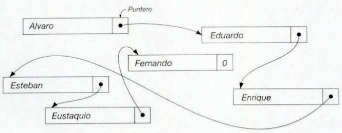
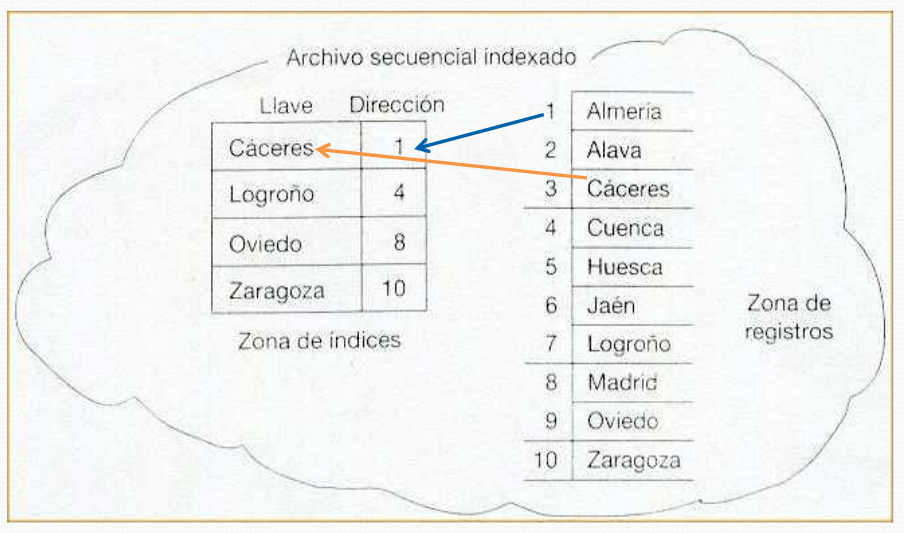
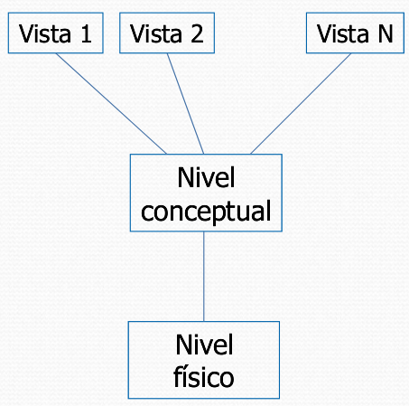

# Tema 4. Sistemas de archivos. Introducción a las bases de datos

## 1. Concepto de archivo y directorio
### 1.1 Concepto de archivo
Los datos que se encuentran en **memoria masiva** suelen organizarse en archivos.

**Archivo** (o fichero) es conjunto de información sobre un mismo tema, tratada como una unidad de almacenamiento en memoria secundaria y organizada de forma estructurada para la búsqueda de un dato individual.

Un archivo está compuesto de **registros homogéneos** que contienen información sobre el tema.

Un **registro** es una estructura o unidad que forma el archivo y que contiene la información correspondiente a un elemento individual.

Un registro se puede dividir en campos. Un **campo** es un dato que forma parte de un registro y representa una información unitaria o independiente.

### 1.1.1 Operaciones sobre archivos
La vida de todo archivo comienza cuando se crea, y acaba cuando se borra. Durante la vida del archivo se suelen realizar sobre él determinadas operaciones de recuperación o consulta y de mantenimiento o actualización. Estas operaciones las realizan programas específicos, que actúan al nivel de registro.

El SO permite que el usuario pueda aludir al archivo mediante un **nombre**, independientemente de la forma en que se almacene en el dispositivo (p.e., un disco).

Todo archivo tiene asociados unos **atributos**, además del nombre, como: tamaño, fecha de creación y de modificación, propietario, permisos de acceso, etc. (dependerá del sistema operativo).

El SO permite que el usuario pueda aludir al archivo mediante un nombre, independientemente de la forma en que se almacene en el dispositivo, y suministra órdenes que realizan operaciones como:
- Crear/copiar/borrar/renombrar un archivo.
- Establecer/obtener atributos de un archivo.
- Abrir/cerrar un archivo para el procesamiento de su contenido.
- Leer/escribir un registro de un determinado archivo.

La mayor parte de las operaciones de recuperación y actualización implican la realización de una localización o búsqueda de un registro concreto para luego actuar sobre él.

Además, existen paquetes de programas específicos denominados sistemas de gestión de archivos que permiten al usuario diseñar archivos con determinadas estructuras y realizar recuperaciones y actualizaciones eficazmente.

### 1.1.2 Gestión de archivos
Cuando un usuario utiliza archivos desde un programa escrito en un lenguaje de alto nivel, el archivo no es manejado directamente por el propio programa, sino por el SO o por el software específico del computador para gestión de archivos.

Este software se encarga de efectuar los accesos necesarios al dispositivo donde se encuentra el archivo y transfiere la información solicitada del archivo al programa, o a la inversa. Esto facilita que los programas sean trasladables, pues no tienen que hacer referencia a la forma específica de gestionar la información sobre el soporte, que puede ser diferente de un sistema a otro.

>Nos dice cómo interviene el SO para manipular los archivos del sistema

### 1.1.2.1 Gestión de archivos: comentarios
- El SO transporta, cada vez que se accede al dispositivo, una cantidad fija de información que depende de las características físicas de éste: **bloque o registro físico**, de longitud distinta al tamaño del registro.
- En el diseño de archivos es importante la longitud de bloque o el factor de blocaje, que es el número de registros del archivo que entran en un bloque. Cuantomayor sea, menor será el número de accesos al dispositivo necesarios para procesar el archivo.
- El SO transforma la **dirección lógica** usada en los programas de usuario en la **dirección física** con la que se direcciona en el dispositivo.
	- La dirección lógica es la posición relativa que ocupa el registro en el archivo, tal y como se ve este desde el programa del usuario.
	- La dirección física es la posición real o efectiva donde se encuentra el registro en el soporte de información.
- Un archivo es una estructura de datos externa al programa que lo usa; en las operaciones de lectura/escritura se transfiere la información a/desde un buffer en memoria principal asociado a las operaciones de entrada/salida sobre el archivo.
- Los archivos se guardan o almacenan en dispositivos de memoria masiva, estando limitados en tamaño tan solo por el de los dispositivos que los albergan. Los dispositivos o soportes de memoria auxiliar, pueden ser de tipo secuencial o no direccionables o de acceso directo o direccionables.
	- En los soportes no direccionables si el último acceso se ha efectuado al registro físico i, para acceder al registo j>i, hay que leer o pasar por los registros situados entre el i y el j.
	- En los soportes direccionables, se puede leer o escribir directamente un registro físico sin más que dar su dirección física, sin necesidad de recorrer o leer otros registros.

### 1.1.3 Clasificación de archivos según el tipo de registros
1. **Longitud fija**: los registros tienen la misma longitud.
2. **Longitud variable**: los registros no tienen la misma longitud. Sin embargo, si se sabe la longitud que tiene cada registro, ya que el sistema reserva una palabra al comienzo de cada registro para anotar su longitud.
	- **Con delimitador:** un determinado carácter llamado delimitador marca el fin de un registro (suelen usarse como delimitadores el salto de línea, nulo...).
	- **Con cabecera:** cada registro contiene un campo inicial que almacena el número de bytes del registro.
3. **Longitud indefinida**: los registros no tienen la misma longitud y no sabemos la longitud que van a tener. El SO no realiza ninguna gestión sobre la longitud de los registros ya que el archivo no tiene realmente ninguna estructura interna. En cada operación de lectura/escritura se transfiere una determinada subcadena del archivo y será el programa de usuario quien indique al SO el principio y final de cada registro.

Una posibilidad añadida: disponer de un **campo clave** (o llave) que permita localizar rápidamente un registro.

Cuando una clave se utiliza como campo de localización en el archivo la denominaremos llave.

### 1.2 Tipos de archivos
- **Archivos permanentes:** contiene información relevante para una aplicación, es decir, los datos necesarios para el funcionamiento de la misma. Su vida es larga y no puede generarse de una forma inmediata a partir de otros archivos. Se pueden clasificar en:
	- **Archivos maestros.** Contiene el estado actual de los datos susceptibles de ser modificados en la aplicación. Es el núcleo central de la aplicación. Todos los procesos están orientados a actualizar el archivo maestro o a obtener resultados de él. Un ejemplo es el archivo de clientes de un banco, en el que los registros contienen información de identificación de clientes, su saldo en cuenta...
	- **Archivos constantes.**
	- **Archivos históricos.**
- **Archivos temporales:** contiene información relevante para un determinado proceso  programa, pero no para el conjunto de la aplicación. Se genera a partir de los datos de archivos permanentes o par actualizar estos, y su vida es muy corta.

### 1.3 Concepto de directorio
**Directorio** es un archivo especial que permite agrupar archivos según las necesidades de los usuarios. En cada dispositivo existe una estructura jerárquica donde se localizan todos los archivos de los distintos usuarios que lo usan.

En la visión que el usuario tiene de la estructura jerárquica de archivos se utilizan los siguientes conceptos:
- Directorio actual o de trabajo.
- Directorio inicial o *home*.
- Rutas (*pathname*) absoluta y relativas.
- Lista de búsqueda.
- Enlace duro, enlace simbólico.

El SO proporciona operaciones para manejar los conceptos anteriores.

## 2. Organización de archivos
Se debe optar por una u otra organización atendiendo a la forma en que se va a usar el archivo. Las principales organizaciones de archivos son:
- **Secuencial.** Los registros se encuentran en cierto orden y yuxtapuestos consecutivamente. Los registros han de ser leídos necesariamente según este orden.
- **Indexada.** Se utiliza un índice para obtener la ubicación de la zona del archivo donde se encuentra del registro buscado. Esto permite localizar un registro sin leer previamente todos los que le preceden (solo los de su zona).
- **Encadenada.** Cada registro contiene un puntero que permite localizar el siguiente registro. El archivo tiene la misma estructura que una lista lineal.
- **Directa.** La ubicación de registro en el soporte se obtiene a partir del valor de la llave (mediante un algoritmo de transformación de esta).

### 2.1 Organización secuencial
Los registros están almacenados físicamente de forma contigua siguiendo la secuencia lógica del archivo.

Todas las operaciones que se realizan sobre el archivo se hacen según esta secuencia. Esta es la única organización de archivos susceptible de ser gestionada en un dispositivo no direccionable (soportes secuenciales tales como cinta magnética, cinta de papel o tarjeta perforada). La secuencia en que aparecen los registros en el archivo puede estar determinada por el valor de algún campo  ser simplemente temporal.

>organización secuencial física: (son...) se da en aquellos dispositivos que son físicamente secuenciales (p.e. CD, cinta magnética...)

Ejemplo de archivo secuencial almacenado en una cinta magnética. (IRG: inter record gap)

La organización secuencial es **adecuada**:
- Cuando se quiere leer los registros en la misma secuencia en que están almacenados.
- Cuando se necesita leer la mayoría de los registros del archivo.

**Ventajas**:
- Buen aprovechamiento del espacio.
- Sencilla de utilizar.
- Se puede utilizar con dispositivos secuenciales que son de bajo precio.

#### 2.1.2 Organización secuencial: operaciones sobre archivos
- **Añadir.** Solo es posible escribir al final del archivo, después del último registro escrito. Es decir, la información se graba en el archivo escribiendo los registros en secuencia, en el orden en que se desea que estén en el archivo.
- **Consulta o recuperación.** Se realiza en orden secuencial, es decir, el orden en el que se hubieran escrito determina el orden en el que se leen los registros. Para leer el registro que ocupa la posición **n** en el archivo es necesario leer previamente los **n-1** registros que hay antes que él. Por ejemplo, si queremos leer el 4º registro, tenemos que leer los registros 1, 2, 3 y 4.
- **Inserción, modificación y eliminación.** No es fácil realizar estas operaciones sobre un archivo secuencial, siendo posible que sea necesario crear otro archivo que incorpore las actualizaciones.
	- La **modificación** de un registro solo es posible si no se aumenta su longitud.
	- No es posible **eliminar** un registro del archivo, pero se puede realizar un borrado lógico, es decir, marcarlo de tal forma que al leer se identifique como no válido.
	- En otros casos es necesario crear un archivo nuevo con las actualizaciones que se quieran realizar.

>No se puede insertar los registros en el medio

### 2.2 Organización secuencial encadenada o lógica
Junto a cada registro se almacena un puntero con la dirección física del registro siguiente, dando lugar a una cadena de registros.

El último registro de la cadena contiene una marca especial en el lugar del puntero indicando que ya no hay más registros en el archivo.

Los archivos con esta organización solo pueden ser gestionados en soportes direccionables. Estructualmente un archivo secuencial encadenado es equivalente a una lista lineal de registros.

**Principal ventaja:** facilidad de inserción y borrado de registros.

**Principal inconveniente:** limita las consultas de forma secuencial.

#### 2.2.1 Organización secuencial encadenada: operaciones sobre archivos
- **Consulta o recuperación.** La consulta es secuencial, al igual que en un archivo con organización secuencial pura. Cada vez que se lee un registro se lee la posición del siguiente, lo que permite seguir la secuencia lógica del archivo.
- **Inserción.** Para insertar un registro hay que seguir los siguientes pasos:
	1. Localizar la posición donde se desea insertar, es decir, entre qué dos registros debe estar el nuevo registro del archivo.
	2. Escribir el registro en una zona libre de memoria.
	3. Asignar al nuevo registro como puntero la dirección física del registro siguiente.
	4. Modificar el registro anterior para actualizar el valor de su puntero de forma que contenga la dirección del nuevo registro.
- **Borrado.** Para borrar un registro se asigna al puntero del registro anterior la dirección del registro siguiente al que se desea borrar.
- **Modificación.** Si el cambio no implica un aumento de longitud del registro, éste puede reescribirse en el mismo espacio. En caso contrario, se debe insertar el registro y luego borrar la versión anterior al cambio.

La principal **ventaja** de la organización secuencial encadenada es la facilidad de inserción y borrado de registros.

Su principal **inconveniente** es, al igual que en la organización secuencial pura, su limitación a consulta es secuencial.

#### 2.2.2 Organización secuencial encadenada: ejemplo de inserción
Se inserta un registro con llave “Gato”.

### 2.3 Organización secuencial indexada
Un archivo con organización secuencial indexada está formado por dos estructuras: zona de registros y zona de índices.

- **Zona de registros:** se encuentran los registros en sí, ordenados según el valor de una llave. Es una zona donde se direccionan los registros del archivo y está dividida en **tramos** (conjunto de registros consecutivos). Por cada tramo hay un registro en un la zona de índices.

- **Zona de índices:** es una zona en la que por cada tramo de la zona de registros hay un registro que contiene:
	- El mayor valor de la **llave** del tramo (valor de llave del último registro del tramo).
	- La **dirección** del primer registro del tramo.

La gestión de la estructura la realiza el SO o un software especial, por lo que el usuario de esta estructura no necesita conocer la existencia de ambas zonas, pudiendo contemplar ambas como un todo.

**Ejemplo.**

>El indice tendria 4 tramos.

>P.e. Logroño esta en el segundo tramo.

>Para buscar Cáceres, leo Almería pero no me dice nada. Ahora tendría que leer cuenca y entonces me habría pasado.

#### 2.3.1 Organización secuencial indexada: operaciones sobre archivos
- **Consulta.** Se realiza por llave (esto es, localizar un registro conocida su llave) sin necesidad de leer los registros que no se encuentran en su mismo tramo. El procedimiento a seguir para realizar una consulta por llave es:
	1. Leer secuencialmente las llaves en la zona de índices hasta encontrar una mayor o igual a la del registro buscado.
	2. Obtener la dirección de comienzo del tramo donde está el registro.
	3. Leer secuencialmente el tramo de la zona de registros a partir de la dirección obtenida en la zona de índices hasta encontrar el registro buscado o uno con valor de llave mayor que el buscado (en este último caso el registro no se encuentra en el archivo).
- **Inserción.** Dado que ambas zonas son secuenciales, no es posible insertar un registro en archivos con esta organización. En algunos casos se permite la escritura de nuevos registros al final de la zona de registros. Estos registros, como es lógico, no podrán ser consultados por llave con el procedimiento descrito anteriormente.
- **Borrado.** Al estar los registros escritos en secuencia no es posible borrar un registro. La única forma de eliminar la información contenida en un registro es marcándolo, lo que se conoce como **borrado lógico**.
- **Modificación.** Las modificaciones son posibles tan sólo si el registro no aumenta de longitud al ser modificado y no se altera el valor de la llave del mismo.

Esta organización resulta **útil** cuando se debe combinar consultas a registros concretos y el procesamiento secuencial de todo archivo.

Su principal **inconveniente** es la imposibilidad de realizar actualizaciones.

Para permitir actualizaciones es necesario incluir en la estructura una zona de **desbordamiento** (zona de *overflow*). En esta zona los registros están desordenados, cada nuevo registro se escriba el final de esta. Esto complica la búsqueda por llave, pues, si el registro no es encontrado en la zona de registros, es necesario buscarlo secuencialmente en la zona de desbordamientos. Además se imposibilita la consulta secuencial del archivo, ya que los registros no aparecen ordenados por llave.

Otra mejora de la estructura anterior es incluir punteros entre los registros de forma que estos mantengan el orden lógico de los registros. A esta organización se le llama **secuencial indexada encadenada**. Cuando se crea un archivo con esta organización, su estructura es igual a la de un archivo secuencial indexado, salvo que se ha previsto un campo en cada registro para albergar un puntero.

#### 2.3.2 Organización secuencial indexada: ejemplo
Consulta de un registro con llave "Digital".

### 2.4 Organización directa o aleatoria
Un archivo con **organización directa o aleatoria** (*random*) es un archivo escrito sobre un soporte de acceso directo (o direccionable) para el cual existe una función de transformación que genera la dirección de cada registro en el archivo a partir de un campo que se usa como llave.

El nombre de “aleatorio” se debe a que normalmente no existe ninguna vinculación aparente entre el orden lógico de los registros y su orden físico. No resulta adecuado realizar una consulta secuencial en un archivo aleatorio, ya que los registros no serían leídos según el orden de la llave.

La organización directa es útil para archivos donde los accesos deben realizarse por llave, accediéndose siempre a registros concretos.

Si la información se va a procesar en conjunto, con frecuencia puede ser más rentable una organización secuencial indexada.

#### 2.4.1 Organización directa o aleatoria: problemas de los sinónimos
Un problema fundamental de esta organización es elegir adecuadamente la **función de transformación o método de direccionamiento** que se va a utilizar ya que pueden darse las siguientes situaciones no deseadas:
- Que haya direcciones que no se corresponden con ninguna llave y, por tanto, habrá zonas de disco sin utilizar.
- Que haya direcciones que se correspondan con más de una llave. En este caso se dice que las llaves son sinónimas para esa transformación o que se produce una colisión.

Hay **dos formas de resolver el problema de los sinónimos**, siempre a costa de complicar la estructura del archivo:
1. Cuando se asocia a una llave **una dirección ya ocupada** por un registro distinto (esto es, por un sinónimo de esta llave), se busca en el archivo hasta encontrar una posición libre donde escribir el registro.

	La búsqueda de una posición libre puede realizarse secuencialmente a partir de la posición asignada, o aplicando a la dirección obtenida un segundo método de direccionamiento. En cualquier caso ambos son lentos y degradan el archivo.
2. Se reserva una **zona de desbordamiento** donde se escribirán los registros que no se pueden escribir en la posición que les corresponde según la transformación. Esta zona se puede gestionar secuencialmente o encadenada a la zona principal de registros.

	Se puede gestionar la zona de desbordamiento secuencialmente o encadenada a la zona principal. Esto último presenta el inconveniente de tener que reservar un puntero en cada registro, pero permite un acceso más rápido a los sinónimos, lo que será más importante que el espacio.

#### 2.4.2 Organización directa o aleatoria: métodos de direccionamiento
1. **Direccionamiento directo.** Se utiliza como dirección la propia llave y solo es factible cuando la llave es numérica y su rango de valores no es mayor que el rango de direcciones en el archivo. Se utiliza como dirección la propia llave.

	Por ejemplo, el archivo de habitaciones de un hotel puede organizarse en forma aleatoria con direccionamiento directo haciendo coincidir la dirección con el número de habitación.

	**Inconveniente:** en algunos casos pueden quedar lagunas de direcciones sin utilizar, en lugares conocidos de antemano. En este caso se pueden ocupar dichas direcciones desplazando las direcciones superiores. Un archivo aleatorio con direccionamiento directo está siempre ordenado.
2. **Direccionamiento asociado.** Se puede utilizar cualquier tipo de llave. Si se utiliza este método debe construirse una tabla en la que se almacena para cada llave la dirección donde se encuentra el registro correspondiente. Dicha tabla se debe guardar mientras exista el archivo.

	Al añadir nuevos registros las llaves se colocan al final de la tabla. Esta se encontrará desordenada. Por tanto, habrá que localizar las llaves en ella por lectura secuencial, lo que ralentiza el acceso, al menos que la tabla esté residiendo en la memoria principal, se indexe, o se ordene y se busque en ella la llave con un procedimiento rápido ("búsqueda dicotómica").
3. **Direccionamiento calculado** (*hashing*). La dirección de cada registro se obtiene evaluando una expresión que utiliza como dato la llave o realizando una transformación sobre la llave. Se utiliza cuando:
	- La llave no es numérica, en cuyo caso se necesita una conversión previa para obtener un número a partir de ella. Por ejemplo se usa el equivalente decimal al propio código binario del carácter (al carácter *A* le correspondería el 65, ...).
	- La llave es numérica pero toma valores en un rango inadecuado para usarse directamente como dirección.

	Con estas transformaciones aparecen sinónimos.

	Métodos de cálculo de dirección:
	- **División.** La dirección es el resto de dividir la llave por una constante (es el mayor de los números primos menores que el número de posiciones del archivo).
	- **Extracción.** Consiste en utilizar como dirección un grupo de cifras de llave, contiguas o no.
	- **Elevación al cuadrado.** Se utiliza cuando la representación numérica de la llave no es muy larga. Consiste en elevar esta al cuadrado y tomar los dígitos centrales. Así, si hay 1000 registros en el archivo y la llave es 3489: primero, se calcula 3489^2 = 123121; segundo, se toma como dirección las tres cifras centrales 3.
	- **Plegamiento.** Se utiliza para llaves muy largas. Se descompone la llave en trozos de cifras contiguas del mismo tamaño y se suman estos. Sobre el número generado se puede aplicar otro método si es necesario.

Siempre que deba accederse a una posición, ya sea para introducir por primera vez un registro o para su consulta o modificación, debe aplicarse a la llave el algoritmo de transformación.

#### 2.4.3 Organización directa o aleatoria: operaciones sobre archivos
- **Consulta.** La consulta se realiza por llave. Para leer un registro debe aplicarse a la llave el algoritmo de transformación, este algoritmo devuelve un número que es la dirección del registro que se quiere leer. Si el registro con la llave buscada no se encuentra allí, se procederá según se haya resuelto la gestión de sinónimos o colisiones.
- **Borrado.** Siempre se realiza un borrado lógico, pudiéndose reutilizar el espacio del registro eliminado.
- **Modificación e inserción.** Siempre se puede modificar o insertar un nuevo registro, realizando la transformación de la llave correspondiente.

La organización directa es **útil** para archivos donde los accesos deben realizarse por llave, accediéndose siempre a registros concretos. Si la información se va a procesar en conjunto con frecuencia puede ser más rentable una organización secuencial indexada.

## 3. Bases de datos
Las bases de datos son estructuras de datos externas a los programas que están almacenados en disco.

En una aplicación convencional con archivos, estos se diseñan de acuerdo con los programas.Esto es, una vez  planteado el problema, se decide si debe haber archivos, cuántos deben ser, qué organización tendrán, qué información contendrá cada uno, qué programas actuarán sobre ellos y cómo lo harán.

Esto tiene la ventaja de que los programas son bastante eficientes, ya que la estructura de un archivo está pensada "para el programa" que lo va a usar.

Sin embargo, conlleva graves inconvenientes:
- Los programas que se realizan con posterioridad a la creación de un archivo pueden ser muy lentos, al tener que usar una organización pensada y creada "a la medida" de otro programa previo que realiza procesos diferentes.
- Si se crean nuevos archivos para los programas que se han de realizar, se puede entrar en un proceso de degeneración de la aplicación, ya que:
	- Gran parte de la información aparecerá duplicada en más de un archivo (redundancias) ocupando la aplicación más espacio del necesario.
	- Al existir la misma información en varios archivos, los procesos de actualización se complican.
	- Se corre el riesgo de tener datos incongruentes entre los distintos archivos. Por ejemplo, tener dos domicilios diferentes de un mismo individuo en dos archivos distintos (por estar uno actualizado y el otro no).

### 3.1 Problemática
En una aplicación convencional con archivos aparecen los siguientes **problemas**:
1. **Dificultad de mantenimiento.** Si hay archivos con información parcialmente duplicada, realizar las actualizaciones necesarias es un problema complejo y costoso. Normalmente, es necesario actualizar varios archivos con diferentes organizaciones. Si la actualización no se realiza correctamente se tendrá información incoherente.
2. **Redundancia.** Se dice que hay redundancia si un dato se puede deducir a partir de otros datos (se dan los problemas explicados en el caso anterior).
	- **Redundancia directa:**
	- **Redundancia indirecta:** la informacion que se puede obtener se duplica. Por ejemplo: la letra del DNI (porque se puede calcular).
3. **Rigidez de búsqueda.** El archivo se concibe para acceder a los datos de un modo determinado. Sin embargo, en la mayoría de los casos es necesario (o al menos deseable) combinar acceso secuencial y directo por varias claves.
4. **Dependencia con los programas.** En un archivo no están reflejadas las relaciones existentes entre campos y registros. El programa que trabaja con el archivo es quien determina en cada caso dichas relaciones. En consecuencia, cualquier modificación de la estructura de un archivo obliga a modificar todos los programas que lo usen. Esto ocurre aun en el caso de que la alteración sea ajena al programa. Así por ejemplo, si se aumenta la longitud de un campo habrá que modificar incluso los programas que no lo usan.
5. **Seguridad.** Uno de los mayores problemas de cualquier sistema de información es mantener la seguridad necesaria sobre los datos que contiene. Si se está trabajando con archivos, el control deberá realizarlo el propio programa. El aspecto de la seguridad es particularmente deficitario en los sistemas de archivos.

### 3.2 Concepto de Base de Datos
Las bases de datos surgen como alternativa a los sistemas de archivos, intentando eliminar o al menos reducir sus inconvenientes.

Una **base de datos** es un sistema formado por un conjunto de datos y un paquete software para gestión de dicho conjunto de datos de tal modo que:
- se controla el almacenamiento de datos redundantes;
- los datos resultan independientes de los programas que los usan;
- las relaciones entre los datos se almacenan junto a ellos;
- se puede acceder a los datos de diversas formas.

En una base de datos se almacenan las relaciones entre datos junto a los datos.

La forma en la que se almacenan las relaciones entre datos y el utilizar como unidad de almacenamiento el campo además del registro, es el fundamento de la independencia respecto a los programas de aplicación.

En cualquier base de datos se puede tolerar un cierto nivel de redundancia. Se utilizan las redundancias para hacer más rápido el acceso y para asegurar la integridad de los datos. Por lo que la gestión de la información redundante es interna a la base de datos.

### 3.3 Requisitos que deben cumplir las bases de datos
1. **Acceso múltiple.** Diversos usuarios pueden acceder a la base de datos, sin que se produzcan conflictos, ni visiones incoherentes.
2. **Utilización múltiple.** Cada usuario podrá tener una imagen o visión particular de la estructura de la base de datos.
3. **Flexibilidad.** Se podrán usar distintos métodos de acceso, con tiempos de respuesta razonablemente pequeños.
4. **Seguridad.** Se controlará el acceso a los datos (a nivel de campo), impidiéndoselo a los usuarios no autorizados.
5. **Protección contra fallos.** Deben existir mecanismos concretos de recuperación en caso de fallo de la computadora.
6. **Independencia física.** Se puede cambiar el soporte físico de la base de datos sin que esto repercuta en la base de datos ni en los programas que la utilizan.
7. **Independencia lógica.** Se pueden modificar los datos contenidos en la base, las relaciones existentes entre ellos o incluir nuevos datos, sin afectar a los programas que la usan.
8. **Redundancia controlada.** Los datos se almacenan una sola vez. (¿La redundancia es indirecta???)
9. **Interfaz de alto nivel.** Existe una forma sencilla y cómoda de utilizar la base al menos desde un lenguaje de programación de alto nivel.
10. **Interrogación directa (“query”).** Existe una utilidad que permite el acceso a los datos de forma interactiva o conversacional.

### 3.4 Estructura de una base de datos
En una base de datos se almacena información de una serie de objetos o elementos. Estos objetos reciben el nombre de **entidades**, siendo una entidad cualquier ente sobre el que se almacena información.

De cada entidad se almacenan una serie de datos que se denominan **atributos** de la entidad. Puede ser atributo de una entidad cualquier característica o propiedad de esta.

Las entidades y los atributos son conceptos abstractos. En una base de datos la información de cada entidad se almacena en **registros**, y cada atributo en **campos** de dicho registro, de forma análoga al almacenamiento en archivos. Sin embargo, en una base de datos **hay diferentes tipos de registros**, uno por cada entidad.

Normalmente se reserva el nombre "registro" para especificar un "tipo de registro", utilizándose otros nombres para especificar cada una de las apariciones de ese registro en la base de datos, tales como: **elemento, valor actual de registro, u ocurrencia de registro.**

Se dice que uno o más atributos de una entidad es un **identificador** o **clave primaria** si el valor de dichos atributos determina de forma unívoca cada uno de los elementos de dicha entidad, y no existe ningún subconjunto de él que permita identificar a la entidad de manera única.

En una base de datos se almacenan además de las entidades, las **relaciones** existentes entre ellas.

En la implementación de la base de datos, estas relaciones se almacenan con punteros que inserta automáticamente el software que la maneja y esto es "transparente" al usuario.

### 3.5 Niveles de abstracción de la información: vistas y esquemas
- **Nivel de vista:** permite describir diferentes **vistas** o **subesquemas**, cada una de las cuales se corresponde con la parte de la base de datos que interesa a un determinado grupo
de usuarios. Además limita el acceso solo a la información de la vista.
- **Nivel conceptual.** Describe el **esquema de la base de datos**. En éste se especifica qué información se guarda en la base de datos,
incluyendo todos los datos almacenados en ella y las relaciones entre ellos. Este nivel se utiliza en la administración de la base de datos.
- **Nivel físico.** Describe cómo se almacenan los datos, con las estructuras de datos necesarias para ello.

### 3.6 Modelos de datos
**Modelo de datos:** grupo de herramientas conceptuales que permite describir los datos, sus relaciones, su semántica y sus limitaciones. Ayuda a describir la estructura de una base de datos.

Clasificación de los modelos de datos:
- **Modelos lógicos basados en objetos.** Describen los datos a nivel conceptual y a nivel de vista, permiten una estructuración flexible y especificar limitaciones de los datos. Caso a tratar: Modelo entidad-relación.
- **Modelos lógicos basados en registros.** Describen los datos a nivel conceptual y a nivel de vista, permitiendo especificar la estructura lógica pero no las limitaciones de los datos. Casos a tratar: Modelo jerárquico, Modelo en red y Modelo relacional.
- **Modelos físicos de los datos.** Describen los datos en el nivel de implementación de los sistemas de base de datos.

### 3.7 Modelo entidad-relación
#### 3.7.1 Conceptos básicos
- **Entidad:** objeto que tiene existencia propia, que puede distinguirse de otros y del cuál se quiere almacenar información de ciertas características. Ejemplo: Pepe con DNI 24324450 y que vive en Granada.
- **Conjunto de entidades:** grupo de entidades del mismo tipo que representa la estructura genérica de una entidad de interés. Las entidades pueden pertenecer a más de un conjunto de entidades. Ejemplo: Cliente.
- **Relación:** asociación entre varias entidades. Ejemplo: El cliente con DNI 24324450 compra un coche con matricula 6670 BBC el 7/11/2005.
- **Conjunto de relaciones:** grupo de relaciones del mismo tipo que representa la estructura genérica de las relaciones entre conjuntos de entidades. Ejemplo: Compra.
- **Grado de una relación:** número de tipos de entidad que intervienen en un tipo de relación. Ejemplo: En el caso de la relación en la que un cliente compra un coche, el grado de la relación es 2.
- **Atributo:** unidad básica de información sobre un tipo de entidad o un tipo de relación. Ejemplos: DNI, Nombre, Dirección, Fecha de compra.

#### 3.7.2 Tipos de correspondencias (cardinalidad)
**Cardinalidad:** expresa el número de entidades con las que puede asociarse o corresponderse una determinada entidad mediante una relación.

En el caso de un conjunto binario de relaciones R entre los conjuntos de relaciones A y B, los tipos de correspondencias o cardinalidades pueden ser:
- **Uno a uno (1:1):** a cada entidad de A le puede corresponder una única entidad de B y viceversa.
- **Uno a muchos (1:N):** a cada entidad de A le puede corresponder más de una entidad de B, pero cada entidad de B solo puede asociarse con una única entidad de A.
- **Muchos a uno (N:1):** a cada entidad de A le puede corresponder una única entidad de B, pero cada entidad de B puede asociarse con varias entidades de A.
- **Muchos a muchos (N:M):** a cada entidad de A le puede corresponder más de una entidad de B, y a cada entidad de B le puede corresponder más de una entidad de A.

**Ejemplo.**

alumno <-> expediente -------- 1 a 1

alumno <->> libro ------------ 1 a N

profesor <<->>alumno --------- N a N

#### 3.7.3 Diagrama entidad-relación
**Diagrama entidad-relación:** representación gráfica de la estructura de una base de datos organizada según el Modelo entidad-relación.

Sus componentes principales son:
- **Rectángulos:** representan conjuntos de entidades.
- **Rombos:** representan conjuntos de relaciones.
- **Elipses:** representan atributos (de conjuntos de entidades o de conjuntos de relaciones).
- **Representación de la cardinalidad.** Se puede hacer de varias maneras:
	- Con una etiqueta asociada al conjunto de relaciones (solo para relaciones binarias).
	- Poniendo una punta de flecha que señale hacia el conjunto de relaciones que participa de forma “uno” y usando una línea sin punta en el caso de conjuntos de entidades que participan de forma “muchos”.

**Ejemplo.**

>El subrayado significa que es una llave.

### 3.8 Modelo lógicos basados en registros
#### 3.8.1 Tipos de bases de datos
1. **Modelo de datos jerárquico.** Permite especificar una **base de datos jerárquica**, donde se establece una relación jerárquica entre los datos en forma de árbol, y no es posible definir relaciones muchos a muchos.

2. **Modelo de datos en red.** Permite especificar una **base de datos en red**, donde pueden darse relaciones binarias con cualquier cardinalidad (1:1, 1:N, N:1, N:N) y no es necesario que la estructura tenga forma de árbol.
3. **Modelo de datos relacional.** Permite especificar una **base de datos relacional**, que estará formada por tablas. Una **tabla** es una estructura bidimensional formada por una sucesión de registros del mismo tipo.
Si se imponen ciertas condiciones a las tablas, se pueden tratar como **relaciones** matemáticas.
Las tablas deben cumplir las siguientes condiciones:
	1. Todos los registros de una tabla son del mismo tipo. Para almacenar registros de tipos distintos se usan tablas distintas.
	2. En ninguna tabla aparecen campos repetidos.
	3. En ninguna tabla existen registros duplicados.
	4. El orden de los registros en la tabla es indiferente. En cada momento se pueden recuperar los registros en un orden particular.
	5. En cada tabla hay una llave, formada por uno o varios campos.

### 3.9 Transformación del modelo entidad-relación al modelo de datos relacional
Dado un Diagrama entidad-relación, el paso a tablas o relaciones del Modelo de datos relacional se efectúa como sigue:
- **Conjuntos de entidades:**
	- Se define una tabla para cada conjunto de entidades.
	- Para cada atributo se define una columna en la tabla.
- **Conjuntos de relaciones sin atributos propios:**
	- **Cardinalidad 1:1:** En la tabla de uno de los conjuntos de entidades (el que se considere principal) se añaden las columnas necesarias para albergar los atributos que forman la clave del otro conjunto de entidades.
	- **Cardinalidad 1:N o N:1:** En la tabla del conjunto de entidades que participa de forma “muchos” se añaden las columnas necesarias para albergar los atributos que forman la clave del otro conjunto de entidades.
	- **Cardinalidad N:M:** Se define una tabla propia para el conjunto de relaciones y, en ella, se definen las columnas necesarias para albergar los atributos que forman la clave de cada uno de los conjuntos de entidades que relaciona ese conjunto de relaciones.
- **Conjuntos de relaciones con atributos propios:**
	- **Cardinalidad 1:1, 1:N o N:1.** Se puede seguir el mismo enfoque dado para conjuntos de relaciones sin atributos propios, pero añadiendo también las columnas necesarias para albergar los atributos del conjunto de relaciones en la misma tabla del conjunto de entidades donde se añada la clave del otro conjunto de entidades. Esta forma está desaconsejada desde el punto de vista conceptual y por cuestiones de mantenimiento del software .
	- **Cardinalidad N:M, 1:1, 1:N o N:1.** Se define una tabla propia para el conjunto de relaciones y, en ella, se definen las columnas necesarias para albergar los atributos que forman la clave de cada uno de los conjuntos de entidades que relaciona ese conjunto de relaciones; en esa misma tabla, además, se definen las columnas necesarias para albergar los atributos propios del conjunto de relaciones.

**Ejemplos.**

## 4. Sistema de gestión de la bases de datos
### 4.1 Definición de sistema de gestión de base de datos
**Sistema de gestión de la base de datos - SGBD** (*Data Base Management System* - DBMS): conjunto de software destinado a la creación, control y manipulación de la información de una base de datos.

Un SGBD debe permitir la realización de las siguientes **tareas**:
1. **Definición** del esquema de la base de datos y de los distintos
subesquemas.
2. **Acceso** a los datos desde algún lenguaje de alto nivel.
3. **Interrogación** (o recuperación de la información) directa en modo
conversacional.
4. **Organización** física de la base de datos y recuperación tras fallos del sistema.

#### 4.2 Lenguajes específicos en un SGBD
Las tres primeras tareas se realizan mediante dos lenguajes específicos:
- **Lenguaje de descripción de datos (DDL**, *Data Description Language*). Se usa para la descripción del esquema y de los subesquemas.
- **Lenguaje de manipulación de datos (DML**, *Data Manipulation Language*). Se utiliza para el acceso a la base de datos desde lenguajes de alto nivel o en modo conversacional.

El **sistema de gestión de la base de datos** actúa como intermediario entre los programas de aplicación y el sistema operativo, lo que permite que los programas sean independientes de la estructura física de los datos.
