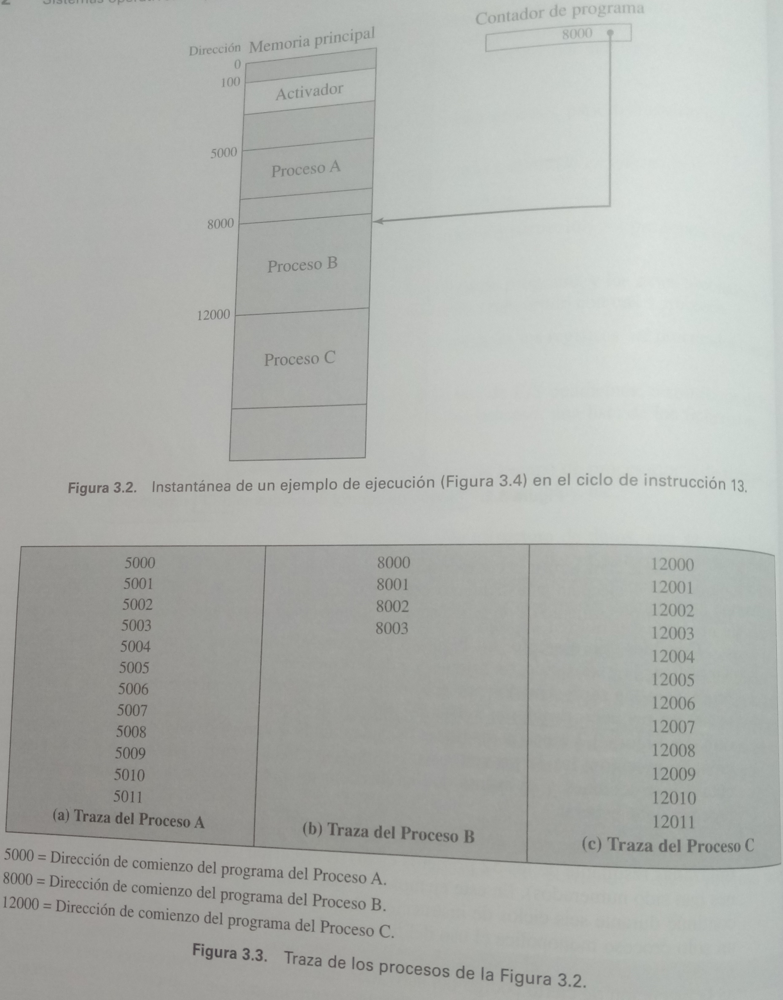

# TEMA 2. Introducción a los sistemas operativos

## Índice
1. [Componentes de un Sistema Operativo (SO) multiprogramado](#1._COMPONENTES_DE_UN_SISTEMA_OPERATIVO_MULTIPROGRAMADO)

2. [Descripción y control de procesos](#2._DESCRIPCIÓN_Y_CONTROL_DE_PROCESOS)

3. [Hebras (hilos)](#3._HEBRAS_(hilos))

4. [Gestión básica de memoria](#4._GESTIÓN_BÁSICA_DE_MEMORIA)

5. [Compiladores](#5._COMPILADORES)

## 1. COMPONENTES DE UN SISTEMA OPERATIVO MULTIPROGRAMADO

### 1.1 Sistemas multiprogramados y de tiempo compartido.
Como el mejor sitio por donde empezar es el principio, comencemos con una breve evolución de las computadoras, hasta un sistema multiprogramado:

1. **Raimundo Lulio** en el siglo XII escribió *Ars Magna*, en el que se dedicó a diseñar y
construir una máquina lógica de naturaleza mecánica, donde las teorías, los sujetos y los predicados
teológicos estaban organizados en figuras geométricas de las consideradas "perfectas".

2. **Leibnitz**, en 1650 construye la primera máquina que multiplica, cuando descubre *Ars magna*
empieza a trabajar en la primera de algoritmo.

3. **Babbage** a principio del siglo XIX construye la primera máquina que procesa información.

4. A mediados del mismo siglo las matemáticas se empiezan a formalizar y estructurarse,
considerándose un fin por sí mismas, surgiendo los axiomas de Peano, lógica... Todo gracias a
personas y asociaciones como: **David Hilbert** y en 1950 **Burbaki**. Gracias a este movimiento,
**Turing** crea las "máquinas de Turing" y posteriormente "la máquina universal de Tuuring" que
podría considerarse uno de los precursores del ordenador.

5. A este ritmo los ordenadores iban surgiendo de manera natural. **A. Church** saca la máquina de
cálculo **Post** y comienzan a aparecer los nuevos paradigmas: operacionales, funcionales y lógicos.

6. Surge el primer ordenador, **Colosus** para generar tablas de tiro, más tarde los ingleses lo
utilizaron para manejar la información de los radares, aunque no se sabe si el primero fue alemán
por los archivos encontrados tras su muerte a **Kamrao Zure** ingeniero para el ejército alemán
durante la primera guerra mundial.

Aquí se acaba la historia con personajes y comienza la evolución de la arquitectura de los
computadores:

### 1.2 **Monoprograma** o **procesamiento en serie**

La más arcaica, requiere de mucho tiempo, el programador tenía interacción directa con el hardware, (no existía el Sistema Operativo) si había un error el programa se detenía.

Estas máquinas eran utilizadas desde una consola que contenía luces, interruptores, algún dispositivo de entrada y una impresora. Los programas en código de máquina se cargaban a través del dispositivo de entrada. Si un error provocaba la parada del programa, las luces indicaban la condición de error. El programador podía entonces examinar los registros del procesador y la memoria principal para determinar la causa de error. Si el programa terminaba de forma normal, la salida aparecía  en la impresora.

Problemas principales de estos sistemas:
- **Panificación** Las instalaciones contaban con plantillas impresas de reserva de tiempo, tiempo limitado (múltiplos de media hora). Por lo que se malgastaba el tiempo de procesamiento del computador.
- **Tiempo de configuración** Un trabajo (único programa) implicaba:
  1. Carga en memoria compilador y lenguaje de alto nivel (programa en código fuente).
  2. Carga y enlace del programa objeto y funciones comunes.
Estos pasos suponían montar y desmontar cintas o configurar tarjetas. Si ocurría un error, el usuario tenía que volver al comienzo de la secuencia de configuración. Lo que significa un tiempo elevado de configuración del programa que se va a ejecutar.

Se han desarrollado varias herramientas de software de sistemas con el fin de realizar el procesamiento serie más eficiente: bibliotecas de funciones comunes, enlazadores, cargadores, depuradores, rutinas de gestión de E/S disponibles como software común para todos los usuarios…

### 1.3 Sistemas en lotes sencillos o Sistemas Batch.
El primer sistema operativo en lotes (y también el primer sisema operativo de cualquer tipo) surge en deseo de maximizar la utilización de las máquinas.
La idea central se basaba en una pieza de software denominada **monitor**: el usuario no tiene que acceder directamente a la máquina, sino que introduce el trabajo por medio de una tarjeta o cinta al operador del computador, que crea un sistema de lotes con los trabajos enviados y los coloca en el dispositivo de entrada para que los utilice el monitor. Cuando un programa finaliza su procesamniento devuelve el control al monitor, que comenzará la carga del siguiente programa.

Análisis de este esquema desde distintos puntos de vista:
- **Punto de vista del monitor**: controla la secuencia de eventos desde la memoria principal, siempre disponible para su ejecución. Esta porción del monitor es denominado **monitor residente**. El resto del monitor está formado por conjunto de utilidades y funciones comunes que se encargan como subrutinas al comienzo del programa del usuario.
  El monitor lee de uno en uno los trabajos desde el dispositivo de entrada (lector de tarjetas o dispositivo de cinta magnética), coloca el trabajo en el área de programa de usuario, y se le pasa el control, que cuando ha terminado le devuelve el control al monitor, que lee el siguiente trabajo. Los resultados de cada trabajo se envían a un dispositivo de salida (impresora) para entregárselo al usuario.

- **Punto de vista del procesador**: el procesador ejecuta instrucciones de la zona de memoria principal que contiene el monitor. Por lo que se lee el siguiente trabajo y se almacena en otra zona de memoria principal. El procesador encontrará una instrucción de salto en el monitor que le indica al procesador que continúe la ejecución al inicio del programa de usuario. El procesador entonces ejecutará las instrucciones del programa usuario hasta que encuentre una condición de finalización o de error. Cualquiera de estas condiciones hace que el procesador ejecute la siguiente instrucción del programa monitor. Por tanto, la frase “se pasa el control al trabajo” significa que el procesador leerá y ejecutará instrucciones del programa de usuario, y la frase “se devuelve el control al monitor” indica que el procesador leerá y ejecutará instrucciones del programa monitor.
Cuando el "control" lo tiene el monitor, ejecutará sus instrucciones y cuando no las del programa. El papel del monitor es de planificación, incluyendo intruccines en algún lenguaje primitivo de **lenguaje de control de trabajos** (JCL)

En resumen: El monitor o sistema operativo en lotes es un programa, que tiene en base la habilidad del procesador para para carga instrucciones de memoria principal y tomar y abandonar el control.

Necesita también un hardware con: protección de memoria, temporizador de trabajos, instrucciones privilegiadas que solo el monitor puede realizar e interrucciones.
La protección de memoria y los privilegios dan lugar a los modos ususario y núcleo.
 El problema de la programación en lotes  era el tiempo que empleaba el ordenador en los periféricos.

### 1.4 Sistemas en lotes multiprogramados
En los trabajos automáticos de un sistema operatuvos en lotes simple el procesador se encuentra frecuentemente parado ya que los dispositivos de entrada y salida son mucho más lentos que este, así es como surge la **multiprogramación** o **multitarea**, se expande la memoria para que pueda albergar al sistema operativo (monitor residente) y más programas habiendo multiplexación entre ellos.
Al haber varios programas a la vez prodría haber un solapamiento del trabajo, ara evitar esto, surgen las **interrupcciones** de la mano de un avanace de sofware y hardware, en el cual varios programas se desarrollan a la vez en sitios diferentes,  esto se conoce como **S.pool**: cualquier trabajo puede suspender su actividad por la ocurrecia de un evento definido, como la finalización de una operación E/S. El procesador guardaría alguna forma de contexto (contador de programa u otros registros) y saltaría a una rutina de tratamiento de interrupciones: determinaría tipo interrución, la procesaría y continuaría con el proceso interrumpido. Por ejemplo si varios porgramas requieren de una impresora, el programa que se está ejecutando escribe en un fichero lo que quiere imprimir y después lo vuelca a esta una vez que ha terminado de utilizar la impresora el programa anterior.

### 1.5 Sistemas de tiempo compartido  
Teniendo en cuenta que los lotes son cerrados surgen las **colas**, sistemas de lotes abiertos, donde el SO controla los programas que esperan y los que se ejecutan, y cuándo termina estos dan pasos a los siguiente en orden de prioridad. Por tanto, si un programa no utilizaba periféricos u otros recursos se podía quedar eternamente allí, o si era necesaria la interacción de varios usuarios directamente con la computadora, con esto surge la técnica  **del tiempo compartido**, los programas tienen un tiempo limitado en la CPU.  Estos intervalos de tiempo, también son conocidos como **cuantos de computación**.
Uno de los primeros sistemas operativos de tiempo compartido desarrollados fue el sistema CTSS (*Compatible Time-Sharing System*) desarrollado en el MIT por un grupo conocido como proyecto MAC y desarrollado para IBM.

 .| Multiprogramación en lotes           | Tiempo compartido
  ---		       | --- 		      		      | ---
 **Objetivo principal**    | Maximizar el tiempo del procesador   | Minimizar el tiempo de respuesta
 **Fuente de directivas del sistema operativo** | Mandatos del lenguaje de control  de trabajos proporcionadas por el trabajp | Mandatos introducidos al terminal.

5. **Multiusuarios** misma idea anterior pero con usuarios, vg: servidores.

6. **Multiprocesadores** más de varias CPU en un mismo ordenador, pueden trabajar en distintas tareas o en **paralelo**, el mismo programa se divide en varios procesadores que trabajan simultáneamente.

7. Finalmente distintos ordenadores, con distintos sistemas operativos que trabajan simultáneamente, todos coordinados por un **macro sistema operativo**.

### Algunas preguntas !!! FALTAN POR COMPLETAR LAS DEJO PARA QUE ALGUIEN LAS RELLENE

- La multiprogramación no tiene por qué ser de tiempo compartido. Pero para que sea posible el tiempo compartido es necesario un S.O. multiprogramado.
- Un S.O. multiprogramado es un S.O. de tiempo compartido? ¿y al contrario?  
- ¿Un S.O. de tiempo compartido tiene que ser multiusuario? ¿y monousuario?  
- ¿Un S.O. monoprocesador tiene que ser monousuario? ¿y multiusuario?  
- ¿Un S.O. multiprocesador tiene que ser monousuario? ¿y multiusuario?  

### 1.6 Procesos
#### 1.6.1 Concepto de proceso

Se han dado distintas definiciones de proceso, algunas: 
- Un programa en ejecución.
- Una instancia de un programa ejecutándose en un ordenador.
- La entidad que se puede asignar o ejecutar en un procesador.
- Una unidad de actividad caracterizada por un solo flujo de ejecución, un estado actual y un conjunto de recursos del sistema asociados.

El diseño del sofware de la multiprogramación era sumamente complejo, los programadores acudían a métodos *ad hoc* para  cooperación y coordinación de trabajos que generaba errores de : sincronización, violación de la exclusión mutua, operación no determinista de un programa, interbloqueos.

Para solucionar estos problemas se necesita una forma sistemática de monitorizar y controla la ejecucion de varios programas en el procesador y aquí es donde entra el concepto de proceso, conformado por:
- Un programa ejecutable
- Los datos asociados que necesita un programa.
- El contexto de ejecución de un programa o estado del proceso, que es el conjunto de datos internos separada del proceso por el cual el sistema operativo es capaz de supervisar y controlar el proceso y el procesador para ejecutarlo. Ejemplos: contador de programa, registro de datos, prioridad, estado...

En la imagen, se muestra la manera de gestinar dos procesos, los contenidos de los registros de un programa que fue interrumpido fueron fuardados en el contexo de ejecución del programa. Por esta razón un proceso puede verse como una estructura de datos, donde su **estado** se contiene en el contexto permitiendo así la cooperación  y la coordinación entre procesos.

> Notas de clase: 
>Cuando hay que leer de disco el sistema usuario no lee, los lenguajes dan sentencias, cuando se traducen son órdenes de llamadas de SO. El SO incorpora funciones propias donde corresponde al programa.
>Lo mismo con lenguajes fuertemente tipado, como hay cosas que el compilador no puede resolver en tiempo de compilación por falta de información, el compilador añade instrucciones al texto (*paquete de soporte a la ejecución*), para  poder ejecutarlo.  Así, se puede denominar *proceso* al programa original ejecutado, es decir quitando la lógica añadida por el SO.
>Ejemplo:
>Cuando, con el navegador abierto, se abre otra ventana del navegador,para cada ventanita hay una **instancia** con la sesión y la historia que guarda el navegador. Es decir, se tiene el mismo programa pero con varias instancias, es decir con distintos procesos. Podemos decir que un proceso o instancia es una ejecución particular del programa.

### 1.7 Implementación de procesos típica
Forma en la cual los procesos pueden gestionarse:
Dos procesos, A y B, se encuentran en una porción de memoria principal. Es decir, se ha asignado un bloque de memoria a cada proceso, que contiene el programa, datos e información de contexto. Se incluye a cada proceso en una lista de procesos que construye y mantien el SO. La lista de procesos contiene una entrada por cada proceso, e incluye un puntero a la ubicación del bloque de memoria que contiene el proceso. La entrada podría también incluir parte o todo el contexto de ejecución del proceso. El resto del contexto de ejecuicón es almacenado en otro lugar, tal vez junto al propio proceso o frecuentemente en una región de memoria separada. El registro índice del proceso contiene el índice del proceso que le procesador está actualmente controlando en la lista de procesos. El contador de programa apunta a la siguiente instrucción del proceso que se va a ejecutar. Los registros base y límite definen la región de memoria y el registro límite le tamaño de la región (en bytes o palabras). El contador de programa y todas las referencias de datos se interpretan de forma relativa al registro base y no debn exceder el valor almacenado en el registro límite. Esto previene la interferencia entre los procesos.
En la imagen anterior (Figura 2.8), el registro índice del proceso indica que el proceso B está ejecutando. El proceso A estab aejecutando previamente, pero fue interrumpido temporalmente. Los contenidos de todos los registros en el momento de la interrupción de A fueron guardados en su contexto de ejecución. Posteriormente, el SO puede cambiar el proceso en ejecución y continuar la ejecución del contexto de A. Cuando se carga el contador de programa con un valor que apunta al área de programa de A, el proceso A continuará la ejecución automáticamente.

- Busca proceso en lista, le da la dirección recuper información con la que  carga la información,
- traza es lo que se pasa, en la CPU

>> que es esooo de arriba¿?¿???!?¿?!

### 1.8 Bloque de control de un proceso (PCB, Process Control Block)
La memoria estaría llena de procesos o instancias. Así, el SO es el encargado de administrarlos de la forma correcta, para que todos sean ejecutados por el procesador de forma secuencial. Además, el SO tiene la capacidad de poder **bloquear un proceso**. Para que después pueda ser retomado como si nada, se  necesita información sobre cada proceso, lo que se conoce como **bloque de control de un programa* (BCP), consta de:

Elemento del bloque de control 	     | Descripción
--- 	     	       		     | ---
 **Identificador de proceso**   (PID *Process IDentificator*)|  Identificador único que se le asocia a un proceso.
 **Estado**      	 	     | En qué situación se encuentra el proceso en cada momento según el modelo de los cinco estados: preparado, bloqueado, preparado...
  **Prioridad**  	  	     | Nivel de prioridad relativo al resto de procesos, el SO, cuenta con algoritmos para modificarla 
  **Contador de programa** 	     | Dirección de la siguiente instrucción del programa  que se va a ejecutar.
  **Punteros a memoria**	     | Direcciones entre las que está un programa, dirección base y sus datos.
  **Datos de contexto** 	     | Datos del registro del procesador: registros que modifica, uso de  recursos, contador de programa, registros procesador...
  **Información del estado de E/S**  | Incluyes las peticiones pendientes de E/S, los dispositivos asignados a dichos procesos de E/S, lista de fichero en uso...
  **Información de auditoría** 	     | Inluye la cantidad de tiempo de de procesador y de reloj utilizados, limites de tiempo, registros contables...

La información de la lista anterior se almacena en una esctructura de datos (PCB), que el SO crea y gestiona. El PCB contiene suficiente información de forma que es posible interrumpir el proceso cuando está corriendo y restaurar su estado de ejecución. Cuando un proceso se interrumpe, los valores de datos de contexto, se guardan en los campos correspondientes, y el estado de proceso cambia, así el SO queda libre para poner otro proceso en estado de ejecución.
Por lo que un proceso está compuesto del código de programa, los datos asociados y del BCP.

### 1.9 Estados de los procesos
Se puede caracterizar el comportamiento de un determinado proceso, listando la secuencia de instrucciones que se ejecutan para dicho proceso (traza del proceso).
La figura 3.2 muestra el despliegue en memoria de tres procesos que no usan memoria virtual, por lo que están representador por programas que residen en memoria principal. Además, existe un pequeño programa activador (dispatcher) que intercambia el procesador de un proceso a otro.
La figura 3.3 muestra las trazas de cada uno de los procesos en los primeros instantes de ejecución. Se muestran las 12 primeras instrucciones ejecutadas por los procesos A y C. El proceso B ejecuta 4 instrucciones y se asume que la cuarta instrucción invoca una operación de E/S, a la cual el proceso debe esperar.
	Desde el punto de vista del procesador se entremezclan las trazas de ejecución de los procesos y las trazas del código del SO. Ejemplo de traza de ejecución:

#### 1.9.1 Modelo de proceso de dos estados
La responsabilidad principal del sistema operativo es controlar la ejecución de los procesos; esto incluye determinar el patrón de entrelazado para la ejecución y asignar recursos a los procesos. El primer paso en el diseño de un sistema operativo para el control de procesos es describir el comportamiento que se desea que tengan los procesos.
Se puede construir el modelo más simple posible observando que, en un instante  dado, un proceso está siendo ejecutado por el procesador o no. En este modelo, un proceso puede estar en dos estados: ejecutando  no ejecutando. Cuando el SO crea un nuevo proceso, crea el BCP para el nuevo proceso e inserta dicho proceso en el sistema de estado no ejecutando. El proceso existe, es conocido por el SO, y está esperando su oportunidad e ejecutar. De cuando en cuando, el proceso actualmente en ejecución se interrumpirá y una parte del SO, el activador, seleccionará otro proceso.
Debe haber información correspondiente a cada proceso, incluyendo el estado actual y su localización en memoria: BCP. Los procesos que no están ejecutando deben estar en una especie de cola, esperando su turno para la ejecución. Existe una sola cola cuyas entradas son punteros al BCP de un proceso en particular. Alternativamente, la cola deb consistir en una lista enlazada de bloques de datos, en la cual cada bloque que representa un proceso. Si el proceso ha finalizado o ha sido abortado, se descarta (sale del sistema). En cualquier caso, el activador selecciona un proceso de la cola para ejecutar.

#### 1.9.2 Llamadas al sistema
>> Carr07 pp. 114-115 COMPLETAR

El usuario no tiene orden para acceder a los recursos "" leer disco?? se llama función SO, para ejecutar eso, (so traa en kernel supe susacio..) la forma de hacerlo se llama **trapa** se cambia de modo usuario a kernel, cuando termina deja de serlo.  

**Paso realizados durante una llamada al Sistema**
>> Completar

#### 1.9.3 Modelo de los cinco estados.

- nuevo

- preparado: si se le acaba el tiempo pasará a preparado

- preparado 

- ejecutándose

- finalizado: si el programa terminade ejecutarse, el SO actualiza la lista de procesos y libera esa zona de memoria, eso se convierte en basura.

Cuando se carga un programa nuevo:

 - instrucciones.

  - datos: variables sin asignar un valor, estas tiene asignado un valor, basura, el que esta en memoria de otro programa. Hauy compiladorea que te permiten ver en la parte derecha, y puede saber que no le has asignado ningún valor, cuando la vas a utilizar te avisan. (otros no te dan ningún error ni en compilación ni en ejecución). Lo que sí se recomienta es trastear con el compilador. Hay compialdores que en el for la i la ponen, otros no la hacen, calculan el número de vueltas que hace el bucle. Otros, que si haces referencia dentro del buche a la i asocia sí lo tienen en cuennta, y si no no. Te implementea la veces que se repite, esta variable se conoce como void variable **variable vacía** .

#### 1.9.4 Transiciones entre estados

Diaposiica, en algunos casos aparece de preparado  finalizado, por el mismos no, porque otro proceso lo mate, la inmensa mayoría de so no lo permite. En modo super usuario sí se puede.

## 2. DESCRIPCIÓN Y CONTROL DE PROCESOS
### 2.1 Descripción de procesos: PCB

- punteros de pila: cuando se ejecutan funciones

diferencia entre un apila: el primero que se atiende el último que ha llegado
cola: se atiende el primero que ha llegado

en la sfuncines cuando se va acumulando se forma n
**registro de activación** donde estan los datos, se guarda la dirección en una pila, tiene una dirección que es lo que se conoce como puntero de pila, que soluciona todos estos prolemas.

#### Creación de un proceso: Inicialización de PCB

### 2.2 Control de procesos
#### 2.2.1 Modo de ejecución del procesador

- modo usuario: no accedo a todos los registro de memora, n contador de programa, o registro de instrucción, tampoco otros instrucuciosnes

- modo núcleo, kernel, supervisoor o sistema:

para pasar de uno a otro, se detecta que hay una operación que no se puede hacer en modo usuario.:
 - cuando hay una llama a sistema: leer disco, C pone un código que supone una rutina del so

  - llamo sistema, se lee el dato que quiero, se manda interrucción, en el ciclo de instrucción mira a ver si era la siguiende, cuan es interrucion so compara la prioridad

  - cuando haya una excepción, algo que no debería ocurrir pero ocurre, "overfloat" se levanta un aaletrar etra el so, si lo que pasa no tiene riesgo para el resto de lo sprocesos se deja pasaer (depende del compilador), otra que ocuure se lee de un ficheo, se acaba y se pide que se igue leeye, s en  este caso se aborta el programa.

  - acceder a zona de memoria que no es de tu proceso.

##### ¿Cómo utiliza el SO el modo de ejecución?

#### 2.2.2 Operación de cambio de modo

#### 2.2.3 Pasos en la operación de cambio de ususario a kernel:

- el que detecta el cambio de modo es el hardware, cuando el compilado detecta qun ainstruccíon, o interrucón o excepción, la circuitería camia a modo kernel, salva el contador de programa, y la palabra de estado del proceso, hay un bits, le cambia el estado,

- se llama a la rutina que lo gestiona, cuando se sabe cuá, la direccion de esta rutina se mete en el contador de programa. Y y aempieza a ejecuatrse esa rutina.

- dependiendo de la "emergencia", es posble que tenga que salvar el resto de registros de la cpu, en un overfloat como no dice nada no cambia nada, en la palabra de estadlo pone un bits, pro si el compilad r lo tennía previsto,

- cuando termina resustaura, contador de programa con el proceso y la palabra de estado,

esencia programa eecutado de usuari a kernel, lo mismo ocurre cuando aparecen nuevos procesos.
diferencai ; como e cambia de proceso se salca todo do bloque del contros del proceso se coge se cambia, slava- guarda.

#### 2.2.4 Operación de cambio de contexto (cambio de proceso)

#### 2.2.5 Pasos en una operación de cambio de contexto (Dispatcher)

## 3. HEBRAS (hilos)
### 3.1 Concepto de Hebra (hilos)

proceso: programa + lo aue necesir a, la unidad de procesamieno, lo qu el so le asigna los recurso que necesite,
puede ocurrirr (cada sistm hace los que le sale de las aricese) ejemplo se está navegando, se abren ventana, proceso s distintos,
tennemso instrucucines y datos, el proceso es el mismo, lo que cambia son lso daos , en vez d arir procesos nueco s, ae abren hebras, proceso el mismo, datos de cada ebra distindo, deteo del bloque de conrtol de proceos se parten nuecos registos , direcciones, se ahor amusah memori ad eisntrucciones.

navegado -->proceso asociado a ese programa, dentro de la misma ejecucion (navegador) se abre una hebra. Hebra eecución independiente del mismo proceso.x
Proceso unidad de gestión de un programa al que se asocian memeoria y gestión, si el codigo es el mismo en una hebra te ahorras el código en memeoria,
la hebra se paparaleliza la ejecución del programa, el mismo código d eprograma abre las ejecuciones paralelas, así el progrma avanza más rápido, hasta sincronizarse esto son hebras de un mismo proceso.
Ejemplo el servidor, hay un progrma uqe continuamente está leyendo el puerto, cuando detecta ue hay una entrada habre un hebra para atencdeae al programa.

elto se utilizar para ecelerar programas, sobretodo programas de cálculo mostruosos,
ventajas de la hebhras, se consume menos memoria, lo estados de las hebras son los mismo que los de los precesos.

#### 3.2 Modelo de cinco estados para hebras

#### 3.3 Ventajas de las hebras

## 4. GESTIÓN BÁSICA DE MEMORIA
### 4.1 Carga absoluta y reubicación
Las direcciones que puede asignar un compilaor son las físiscas o absolutas y ls que empiezan en cero, realticas o lógicas, utilizar siempre absolutas implicaría que simpre se utilizase la misma direcciones de memoria, en el caso de instrucciones se suma lo mismo o en el caso de bucles también se saltas. (ver diapositicas 34 )
cuando se compila un programa se realiza la reubicación, a la carga relativa se el suma la dirección inicial en la que se inicia.
(en el nucleo, el esto tiene direccione es carga absoluta, en el se basa el grub)
si la máquina que tienes no tiene la memeoria suficiente,ejecutar los mismos programas comparando con una de mauor, lo que tiene poca memrooa, lo que tiene que hacer es coger y descargar los procesos de discos, la rocalización supone supa cálculo...

### 4.2 Reubicacion estática
la dirrecciones llogicas se combietens en fisiaca sdespues de la de compilaciosn y cantes de la ejecucaion, antes de uqe use la dirección, estos dos momentos son estáticas y dinámica.  Lo que es dináico es en timepo de ejecución, todo lo est´atico es antes de la ejecución,
la reubicacion estática consiste en el momento so sepa en que sitio de momoria va a colocar el programa, se hace durante el momento de la carga, so sabe a partid direccion de memro lo va a cargar, a todas las referencis le suma la dirección base, el códidog qeu se escribe elm momoria yya tiene direccion absulotga.
ventajas, se cambia un asola vez, inconvenintes, lo que estña ahí ya no se puede cambiar,
- dinámica en el momento de la carga se enscbe en momoria princioa direccione slógicas y cada vez que se accede a direc de momeor se lae suma diección base, en memroria son direccone logicas, acada cex que se accede se suma direccion base, que se le suma a la absoluta.  Si mi programa recorre sisitios por los que no pasa , en la acrualidad lo que se utiliza es la dinamica porque la cpu está ya diseñada paa haer eso.

### 4.3 Reubicación dinámica

### 4.4 Espacios para las direcciones de memoria
mientras que un asesturuciion se ejejcuta se solapan las , en el tiempo de ejecucion global no influyen estas cosas porque es otra unidad la qeu se encarga,
- direcciones lógicas  ensambalsdo rconmidaldo

espacio dirrecione sfísica
el so mantiene un mapa de la memor de un ordenado, el

y tamantiene un mapa de memoria de cada proceso, lo que se mejte en cada momento mñas o menos el númeo del ejecutable de un modo o oro,
taba de simbolos, va cogiendo los ombres y asignádoselo a una dirección, cuando se está haciendo la compilación, aparecen siboloa squ eno sresuelca el compilador, nombres de funcione sexternas, el encuadrernar se encarga de los otro, de esto se encarga el ejejcutable,	la tabla de simbolos puede o no ir, dpende de como se resuelva la encuadernación o el enlace, esta puede ser estática, estas referencias ya las resuelcv ale encuador en princio dnp hará falaa al ora, si se hace dinámica els necesara la tabla de sñimbolos 

los datos a los que se le asigna un valor al principio estarían después del código
En argurmentos de programa y la pila . Cuando se llama a una fución, se va generando una pila, y cuando se coge se
se crea una zona que se crea **registro de activación** valores de los argumento que contiene las funciones, según se generen se va creando, si no borra, pero se borra. Para buscar una variable busca en los registros que lo han llamado, sino en la siguiente (diferencia entre variables globales)

Lo qu ese guarda en una pila de la cpu es la direcciónn de la dirección quu ees distinta a la pila de proceso, que esta es la pila de la cpu.
otra en memoria principa donde está el regstro de activacion las variables loales

----
codgo
---
variable iniciaes
---
variables si inicial (bajando)
---
---
montículo(subiendo) o módulo

en el montículo va la variables dináicas, las listas, las pilas que creen se quedan al final de la zona de memor¡ria que asigne el so.

para vitar que tanto subir el mónticulo cada vez que se cree borre, **recolector de basura** que compacta el espacio no utilizado en memoria.

### 4.5 Problema de la fragmentación de memoria

El núcle del sistema operativo está cargado en las direcciones de memoria más baja, el firmeare nada más empezar carga el so, que va cargado.
Supongamos que el So empieza a generar z¡proceso que se van desarrollando de arriba a bajo y pueden que empiecen a quedar huecos, que la solución no sea descargar y cargar lso procesos de nuevo.
La fra¡gmentación consitste en trocear los procesos:
- una en plan dictarorial, todo se parte de la misma manera, la memoria se divide en trozos iguales, entre 512 k y 800k,? esos trozos son **marcos**, pro otra parte se tienen los procesos que se dividen en trozos iguale, salvo el último que puede ser más perqueños, estos trozos del mismo tamaño que el marco se llama **páginas**, esto es físicamente como está.
Normalmente la paginación por una parte va el código y por otra los datos, cuando se ejecuta el le proceso los marcos empinezan a ocuparse, cuando ba a cargar unproceso en el mapa de marcos libres coje y mete páginas del porceos que no cecesariamente tiene que estar ordenados. Para acceder a una dirección, saber la página en que está, y dentro de la página el desplazamiento desde el principipp cuando se esté ejecutando necesito saber en que marco se está desarrollando.

- Segmentación , divide el progrma en trozos que estén relacionados con la arquitectura que tiene, los trozos no tienen por qué ser iguales,
Las direccione logicas de la paginación se deberá de dar el pagína eu el desplazamiento.
 El so crea una tabla de paginas (entrada) y en cada fila aparece el marco en el que está la página y un bits d eprotección si se puede escrbir ysi se pude escribir. La tabla de páginas está en memoria principal, por tanto la tabla empezará a partir de una determinada dirección base, esa dirección base, cuando se ejecuta el proceso se carga en registro base de la tabla de págiana,
 (el desplazamiento es el mismo dentro y fuera de la máquina)

ventaja: se gestiona mejor la memoria.
desvetanjas lso accesos a memoria, sin fragmentación es muy rápida, de la otra manera hay que hacer varias acceso, registros
1. cpu memroria principas--> lee marco
2. memoria al marco 25 --> coge desplaczamein

en total hace dos accesoa a memoria.

### 4.6 Solución a la fragmentación de memoria
Para solucionar ese problema, Buffer de traducción adelantada TLB, lo que se tiene en cpu, es un trocito de la tabalde página en marcos, se lee ese trocito, si aparece el marco, solo habría un acceso, si no se Esta memoria se llama Caché, memoria muy rápida.  La forma de acceder pro ardware, inteneta buscar esa página el paralelo, esta tabla tiene número pagin num marco y bits de protección, en cache no necesta el número de páginas

#### 4.6.1 Paginación

##### 4.6.1.1 Contenido de la tabla de páginas

##### 4.6.1.2 Esquema de traducción

##### 4.6.1.3 Implementación de la Tabla de Páginas

##### 4.6.1.4 Búfer de Traducción Adelantada (TLB)

#### 4.6.2 Segmentación

##### 4.6.2.1 Tabla de Segmentos

##### 4.6.2.2 Implementación de la Tabla de Segmentos

##### 4.6.2.3 Esquema de traducción

## 5. COMPILADORES

Ejemplo de sentencia de un programa a1 = b + c + 13. 77
El compilador lee de izquierda a derecha e intenta identificar cada elemento, construyendo
una **tabla de símbolos**.

Signo |  Datos |  Dirección memoria asociada
------| ------ | -----------------------------
a1    |   666  |   0xab0f20x53 (En hexadecimal)

De esta manera, cada vez que se haga referencia a *a* se redirecciona a la dirección asignada por el compilador.

En los primeros compiladores el número de direcciones era menor y se podía hablar de dirección de memoria absoluta. Sin embargo, en la actualidad, a alto nivel, el uso de direcciones es más complejo, abarcando incluso direcciones de direcciones, como es el caso de de las sentencias de control (if, while...).
Para facilitar el trabajo se hacen asignaciones de **memoria relativa** en lo que respecta a la zona de memoria que se le otorga.  Estas direcciones
relativas comienzan en 0 y continuan dependiendo del tamaño en bytes del tipo
de dato almacenado. 

Los pasos que comprenden un programa antes de ser ejecutado son: compilación,encuadernación y la formación del ejecutable:

- Durante la carga del programa, se lee del disco y se copia esa información en memoria principal por el SO. El SO contiene un *mapa* con las direcciones relativas de memoria. Estas se suman a la llamada **dirección base**, para obtener las direcciones reales (cada vez que se quiera acceder a una variable durante la ejecución).

El SO también protege sobre problemas del programa. Por ejemplo, el acceso a los dispositivos lo hacen rutinas del SO, que comprueban si la dirección de memoria a la que accede el programa es correcta. En caso contrario, el SO se encargar de abortar el programa.

Volviendo a cómo se almacenan la variables, en lo concerniente a las constantes, estas se tratan exactamente igual que las simbólicas, con la única diferencia que como identificador, el nombre de la variable es el propio símbolo, el resto es lo mismo, como valor se guarda a ellos y tiene también una dirección de memoria asociada.

  - **Punteros**: Es una variable que almacena una dirección de memoria.  Son la base de las estructuras dinámicas de datos. El riesgo de su uso radica en la posibilidad de sobreescribir los datos de la memoria por error.

  - **Arrays**: son realmente punteros encadenados en bloques de memoria. Así, es posible recorrer el *array* mediante aritmética de punteros, es decir,aumentando en 1 la dirección de memoria asociada.

  - Existen dos formas de pasar argumentos a una función:

    - *Por valor*: en la función se trabaja sobre una copia del valor pasado. Se puede considerar más seguro ya que un cambio en la variable dentro de la función no influye de ninguna forma al valor original.

    - *Por referencia:* a la función se le pasa la dirección de memoria de una variable. Por tanto, la función puede modifica el valor original, lo que constituye un riesgo en caso de error.

> En el caso de C++ existen dos subtipos de paso de referencias: por punteros, o por referencias. El paso por punteros es heredado de C, mientras que las referencias son específicas de C++, y facilitan el paso de referencias evitando errores debidos al trabajo con punteros.

### 5.1 Resumen

El compilador conforme traduce, asigna direcciones relativas a variables y controladores de flujo. Cuando el programa se carga en memoria el SO es el encargado de gestionar el acceso del programa en memoria.

