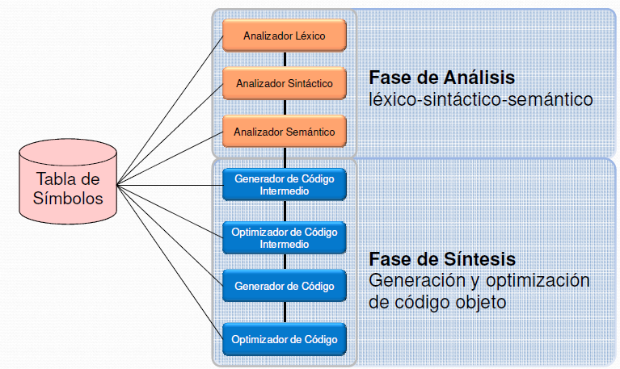
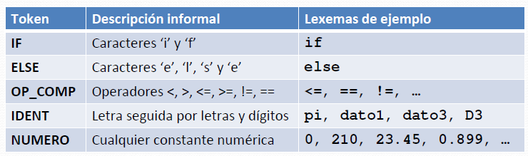
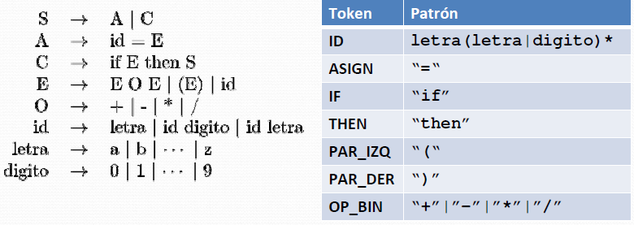
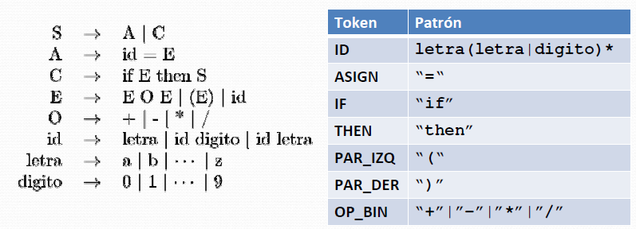
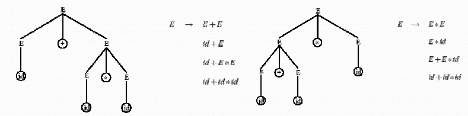
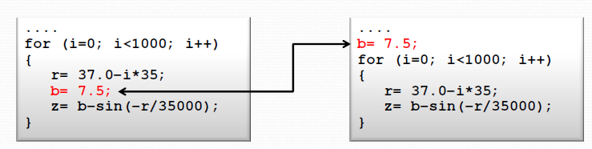
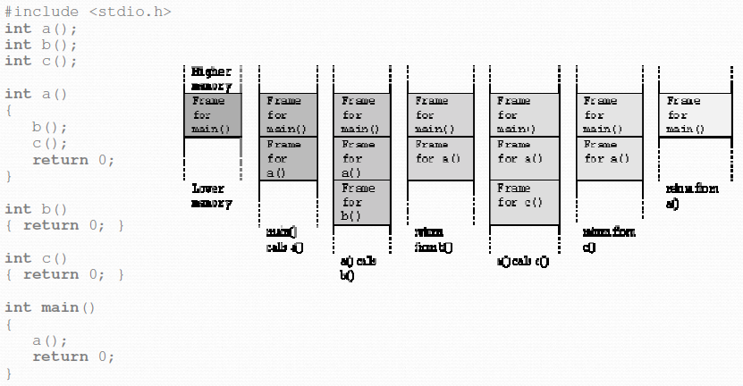
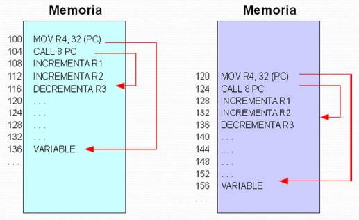
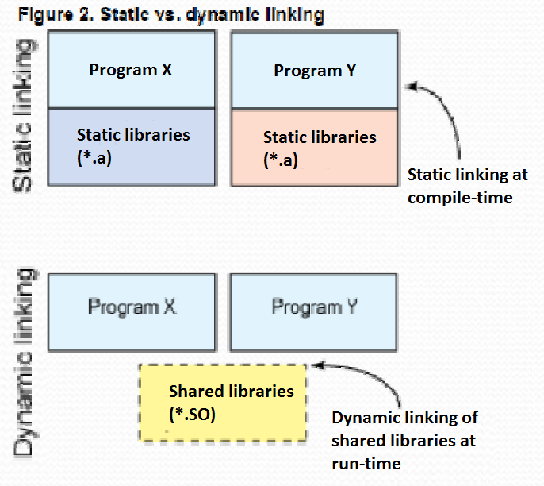

> Estos apuntes son solo lo que pone en los libros y en las diapositivas. No hay apuntes de clase (Excepto del último día).

# Tema 3. Compilación y enlazado de programas

## 1 Lenguajes de programación
### 1.1 Concepto de lenguaje de programación
Un **lenguaje de programación** es un conjunto de símbolos y de reglas para combinarlos, que se usan para expresar algoritmos.

Poseen un **léxico** (vocabulario o conjunto de símbolos permitidos), una **sintaxis** (indica cómo realizar construcciones del lenguaje) y una **semántica** (determina el significado de cada construcción correcta.

Los lenguajes de programación, o lenguajes de alto nivel, están específicamente diseñados para programar computadores. Sus características son:
- Son **independientes** de la arquitectura física del computador. Por tanto, no obligan al programador a conocer los detalles del computador que utiliza, y permiten utilizar los mismos programas en computadores diferentes, con distinto lenguaje de máquina (*portabilidad*).
- Una **sentencia** en un lenguaje de alto nivel da lugar, tras el proceso de traducción, a **varias instrucciones** en lenguaje máquina.
- Algo expresado en un lenguaje de alto nivel utiliza **notaciones más cercanas a las habituales** en el ámbito en el que se usan.

Ejemplo de como una sentencia de un lenguaje de alto nivel da lugar a varias instrucciones ensamblador y máquina:

La utilización de conceptos habituales suele implicar las siguientes cualidades:
- Las instrucciones se expresan por medio de **texto**, conteniendo caracteres alfanuméricos y especiales (+, =, / ...).
- Se puede asignar un **nombre simbólico** a determinados componentes del programa, es decir, se pueden definir **variables** con casi cualquier nombre. La asignación de memoria para variables y constantes las hace el traductor.
- Contiene **operadores** y **funciones**: aritméticas (seno, coseno...), especiales (cambiar un dato de tipo real a entero...), lógicas (comparar...), de tratamiento de caracteres (buscar una subcadena en una cadena de caracteres...), etc.
- Pueden incluirse **comentarios** en las líneas de instrucciones o específicas.

Aunque los programas escritos en lenguajes de programación no pueden ser directamente interpretados por el computador, siendo necesario realizar previamente su *traducción* a lenguaje máquina. Hay dos tipos de traductores de lenguajes de programación: compiladores e intérpretes.

## 2 Construcción de traductores
### 2.1 Definición de traductor
**Traductor** es un programa que recibe como entrada un texto en un lenguaje de programación concreto y produce, como salida, un texto en lenguaje máquina equivalente.
Entrada -> lenguaje fuente, que define a una máquina virtual.
Salida --> lenguaje objeto, que define a una máquina real.

La forma en la que un programa escrito para una máquina virtual es posible ejecutarlo en una máquina real puede ser:
- Compilador.
- Intérprete.

### 2.2 Definición de compilador
**Compilador** traduce la especificación de entrada a lenguaje máquina incompleto y con instrucciones máquina incompletas -> necesidad de un complemento llamado enlazador.

**Enlazador** (linker) realiza el enlazado de los programas completando las instrucciones máquina necesarias (añade rutinas binarias de funcionalidades no programadas directamente en el programa fuente) y generando un programa ejecutable para la máquina real.

### 2.3 Definición de intérprete
**Intérprete** lee un programa fuente escrito para una máquina virtual realiza la traducción de manera interna y ejecuta una a una las instrucciones obtenidas para la máquina real.

No se genera ningún programa objeto equivalente al descrito en el programa fuente, si no que da lugar a la ejecución inmediata del programa.

### 2.4 Esquema de traducción
Fases en la traducción de un programa fuente a un programa objeto, por un compilador:

### 2.5 Definición de gramática
La complejidad de la verificación sintáctica depende del tipo de gramática que define el lenguaje.

Una gramática definida como G=($V_N$, $V_T$, P, S), donde:
- $V_N$ es el conjunto de símbolos no terminales.
- $V_T$ es el conjunto de símbolos terminales.
- P es el conjunto de producciones.
- S es el simbolo inicial.

**EJEMPLO.**
Dada la gramática siguiente:

Y el texto de entrada: 
		id+id*(id-(id/id))

Usando las reglas de formación gramatical, se obtendría una representación que valida la construcción del texto de entrada -> verificación sintáctica correcta.

## 3. Fases de traducción
### 3.1 Fases en la construcción de un traductor

### 3.2 Análisis léxico
#### 3.2.1 Función principal y conceptos
**Función:** Leer los caracteres de la entrada del programa fuente, agruparlos en lexemas (palabras) y producir como salida una secuencia de tokens para cada lexema en el programa fuente.

Conceptos que surgen del Analizador Léxico:
- **Lexema o Palabra:** Secuencia de caracteres del alfabeto con significado propio.
- **Token:** Concepto asociado a un conjunto de lexemas que, según la gramática del lenguaje fuente, tienen la misma misión sintáctica.
- **Patrón:** Descripción de la forma que pueden tomar los lexemas de un token.

El analizador léxico realiza otras funciones secundarias:
- Identifica y salta comentarios.
- Identifica y pasa espacios en blanco y tabulaciones.
- Informa de posibles errores de léxico.

**EJEMPLO 1**

**EJEMPLO 2**

**EJEMPLO 3**

Al realizar el análisis léxico de la sentencia Pascal

		Intensidad := (Magnitud + D) * 17

se generará la siguiente secuencia de símbolos:

		Identificador [1]
		Asignación
		(
		Identificador [2]
		Operador +
		Identificador [3]
		)
		Operador *
		Número [1]

#### 3.2.2 Error léxico
En muchos lenguajes de programación, se cubren la mayoría de los siguientes tokens:
- Un token para cada palabra reservada (if, do, while, else, ...).
- Los tokens para los operadores (individuales o agrupados).
- Un token que representa a todos los identificadores tanto de variables como de subprogramas.
- Uno o más tokens que representan a las constantes (números y cadenas de
literales).
- Tokens para cada signo de puntuación (paréntesis, llaves, coma, punto, punto y coma, corchetes, ...).

**Error léxico:** Se producirá cuando el carácter de la entrada no tenga asociado a ninguno de los patrones disponibles en nuestra lista de tokens (ej: carácter extraño en la formación de una palabra reservada: **whi¿le**)

#### 3.2.3 Especificación de los Tokens usando expresiones regulares
Se pueden usar expresiones regulares para identificar un patrón de símbolos del alfabeto como pertenecientes a un token determinado:
1. Cero o mas veces, operador *
2. Uno o más veces, operador +: r* = $r^+$|$\lambda$
3. Cero o una vez, operador ?
4. Una forma cómoda de definir clases de caracteres es de la siguiente forma:
		a|b|c|···|z = [a-z]

#### 3.2.4 Especificación de los Tokens
Dada la gramática mostrada anteriormente, los patrones que van a definir a los tokens serían los que muestra la tabla de la derecha:

### 3.3 Análisis sintáctico
Un programa es sintácticamente correcto cuando sus estructuras (expresiones, sentencias declarativas, asignaciones...) aparecen en un orden correcto.

Las gramáticas ofrecen beneficios considerables tanto para los que diseñan lenguajes como para los que diseñan los traductores. Destacamos:
- Una gramática proporciona una especificación sintáctica precisa de un lenguaje de programación.
- A partir de ciertas clases gramaticales, es posible construir de manera
automática un analizador sintáctico eficiente.
- Permite revelar ambigüedades sintácticas y puntos problemáticos en el diseño del lenguaje.
- Una gramática permite que el lenguaje pueda evolucionar o se desarrolle de
forma iterativa agregando nuevas construcciones.

#### 3.3.1 Función del analizador sintáctico
**Objetivo:** Analizar las secuencias de tokens y comprobar que son correctas sintácticamente.

A partir de una secuencia de tokens, el analizador sintáctico nos devuelve:
- Si la secuencia es correcta o no sintácticamente (existe un conjunto de reglas gramaticales aplicables para poder estructurar la secuencia de tokens).
- El orden en el que hay que aplicar las producciones de la gramática para obtener la secuencia de entrada (**árbol sintáctico**).

Si no se encuentra un árbol sintáctico para una secuencia de entrada, entonces la secuencia de entrada es incorrecta sintácticamente (tiene errores sintácticos).

#### 3.3.2 Gramáticas libres de contexto
> Completar con (Aho08, pp197)

Una gramática definida como G=($V_N$, $V_T$, P, S), donde:
- $V_N$ es el conjunto de símbolos no terminales.
- $V_T$ es el conjunto de símbolos terminales.
- P es el conjunto de producciones.
- S es el símbolo inicial.

se dice que es una gramática libre de contexto cuando el conjunto de producciones P obedece al formato:

es decir, solo admiten tener un símbolo no terminal en su parte izquierda. La denominación *libre de contexto* se debe a que se puede cambiar A por $/alfa$ , independientemente del contexto en el que aparezca A.

#### 3.3.3 Gramáticas ambiguas
Una gramática es ambigua cuando admite más de un árbol sintáctico para una misma secuencia de símbolos de entrada.

**Ejemplo 3.2**: Dadas las producciones de la gramática del ejemplo 4.1 y dada la misma secuencia de entrada **id+id*id**, se puede apreciar que le pueden corresponder dos árboles sintácticos.

Cuando programamos en un determinado lenguaje:

¿A qué nos referimos cuando hablamos de “precedencia de operadores”?

¿Por qué hay que utilizar los paréntesis para evitar la precedencia de operador?

### 3.4 Análisis semántico
Semántica de un lenguaje de programación es el significado dado a las distintas construcciones sintácticas.

El proceso de traducción es la generación de un código en lenguaje máquina con el mismo significado que el código fuente.

En los lenguajes de programación, el significado está ligado a la estructura sintáctica de las sentencias.

En el proceso de traducción, el significado de las sentencias se obtiene de la identificación sintáctica de las construcciones sintácticas y de la información almacenada en las tablas de símbolos.

*Ejemplo:* En una sentencia de asignación, según la sintaxis del lenguaje C, expresada mediante la producción siguiente:

		sent_asignación -> IDENTIFICADOR OP_ASIG expresion PYC

		Donde *IDENTIFICADOR*, *OP_ASIG* y *PYC* son símbolos terminales (tokens)
		que representan a una variable, el operador de asignación "="
		y al delimitador de sentencia ";" respectivamente, deben cumplirse
		las siguientes reglas semánticas:
		- *IDENTIFICADOR* debe estar previamente declarado.
		- El tipode la *expresion* debe ser acorde al tipo del *IDENTIFICADOR*.

 

- Durante la fase de análisis semántico se producen errores cuando se detectan
construcciones **sin un significado correcto** (p.e. variable no declarada, tipos incompatibles en una asignación, llamada a un procedimiento incorrecto o con número de argumentos incorrectos, ...).
- En lenguaje C es posible realizar asignaciones entre variables de distintos tipos, aunque algunos compiladores devuelven **warnings** o avisos de que algo puede realizarse mal a posteriori.
- Otros lenguajes impiden la asignación de datos de diferente tipo (lenguaje Pascal).

### 3.5 Generación de código
- En esta fase se genera un archivo con un código en lenguaje objeto (generalmente lenguaje máquina) con el mismo significado que el texto fuente.
- El archivo-objeto generado puede ser (dependiendo del compilador) directamente ejecutable, o necesitar otros pasos previos a la ejecución (ensamblado, encadenado y carga).
- En algunos, se intercala una fase de generación de código intermedio para
proporcionar independencia de las fases de análisis con respecto al lenguaje máquina (portabilidad del compilador).
- En la generación de código intermedio se completan y consultan las tablas generadas en fases anteriores (tablas de símbolos, de constantes...). También se realiza la asignación de memoria a los datos definidos en el programa.

### 3.6 Optimización de código
- Se mejora el código mediante comprobaciones locales a un grupo de instrucciones (bloque básico) o a nivel global.
- Se pueden realizar optimizaciones de código tanto al código intermedio (si existe) como al código objeto final. Generalmente, las optimizaciones se aplican a códigos intermedios.

*Ejemplo*: Una asignación dentro de un bucle for en lenguaje C:

### 3.7 Fases de traducción
*Ejemplo*

>Completar con Aho08

## 4. Intérpretes
**Intérprete:** hace que un programa fuente escrito en un lenguaje vaya, sentencia a sentencia, traduciéndose y ejecutándose directamente por el computador. El intérprete capta una sentencia fuente, la analiza e interpreta dando lugar a su ejecución inmediata.

Consecuencias inmediatas:
- No se crea un archivo o programa objeto almacenable en memoria para posteriores ejecuciones.
- La ejecución del programa escrito en lenguaje fuente está supervisada por el intérprete.
- Ejemplo: Bash

En la práctica, el usuario crea un archivo con el programa fuente. Esto suele realizarse con un editor específico del propio intérprete del lenguaje. Según se van almacenando las instrucciones simbólicas, se analizan y se producen los mensajes de error correspondientes; así el usuaario puede dar la orden de ejecución y el intérprete lo ejecuta línea a línea. Siempre el análisis antecede inmediatamente a la ejecución.

¿Cúando es **útil** un intérprete?
- El programador trabaja en un entorno interactivo y se desean obtener los resultados de la ejecución de una instrucción antes de ejecutar la siguiente.
- El programador lo ejecuta escasas ocasiones y el tiempo de ejecución no es importante.
- Las instrucciones del lenguaje tiene una estructura simple y pueden ser analizadas fácilmente.
- Cada instrucción será ejecutada una sola vez.

¿Cuándo **no es últil** un intérprete?
- Si las instrucciones del lenguaje son complejas.
- Los programas van a trabajar en modo de producción y la velocidad es importante.
- Las instrucciones serán ejecutadas con frecuencia.

## 5. Modelo de memoria de un proceso
El SO gestiona el mapa de meomria de un proceso durante la vida del mismo. Además, el mapa inicial de un proceso está muy vinculado con el archivo que contiene el programa ejecutable asociado al mismo.

Los programadores desarrollan sus aplicaciones utilizando lenguajes de alto nivel. Por lo que una aplicación estará compuesta por un conjunto de módulos de código fuente que deberán ser procesados para obtener el ejecutable de la aplicación. Este procesamiento consta de dos fases:
- **Compilación**: se genera el código máquina correspondiente a cada módulo fuente de la aplicación asignando direcciones a los símbolos definidos en el módulo y resolviendo las referencias a los mismos. Como resultado de esta fase se genera un módulo objeto por cada archivo fuente.
- **Montaje o enlace**: se genera un ejecutable agrupando todos los archivos objeto y resolviendo las referencias entre módulos.

En resumen, los elementos responsables de la gestión de memoria son:
- Lenguaje de programación.
- Compilador.
- Enlazador.
- SO.
- MMU (Memory Management Unit).

### 5.1 Niveles de la gestión de memoria
- **Nivel de procesos** - reparto de memoria entre los procesos. Responsabilidad del SO.
- **Nivel de regiones** - distribución del espacio asignado a un proceso a las regiones del mismo. Gestionado por el SO.
- **Nivel de zonas** - reparto de una región entre las diferentes zonas (nivel estático, dinámico basado en pila y dinámico basado en heap) de ésta. Gestión del lenguaje de programación con soporte del SO.

### 5.2 Necesidades de memoria de un proceso
- Tener un espacio lógico independiente.
- Espacio protegido del resto de procesos.
- Posibilidad de compartir memoria.
- Soporte a diferentes regiones.
- Facilidades de depuración.
- Uso de un mapa amplio de memoria.
- Uso de diferentes tipos de objetos de memoria.
- Persistencia de datos.
- Desarrollo modular.
- Carga dinámica de módulos.

### 5.3 Modelo de memoria de un proceso
Estudiaremos aspectos relacionados con la gestión del mapa de memoria de un proceso, desde la generación del ejecutable a su carga en memoria:
- Nivel de región.
- Nivel de zona.

Para ello veremos:
- Implementación de tipos de objetos necesarios por un programa.
- Ciclo de vida de un programa.
- Estructura de un ejecutable.
- Bibliotecas.

### 5.4 Tipos de datos
- Datos estáticos
- Globales
- Constantes o variables
- Con o sin valor inicial – direccionamiento relativo: PIC. Se trata de una región privada ya que cad aproceso que ejecuta un determinado programa necesita una copia propia de las variables del mismo.

 

- Datos dinámicos asociados a la ejecución de una función:
- Se almacenan en pila en un **registro de activación  de las llamadas a funciones (las variables locales, parámetros, dirección de retorno...)**
- Datos dinámicos controlados por el programa – **heap**. Esta región sirve de soporte para la memoria dinámica que reserva un programa en tiempo de ejecución. Cada programa tiene un único *heap*.

### 5.5 Ejemplo de evolución de la pila (stack) en la ejecución de un programa

### 5.6 Código independiente de la posición (PIC, Position Independent Code)
- Un fragmento de código cumple esta propiedad si puede ejecutarse en cualquier parte de la memoria.
- Es necesario que todas sus referencias a instrucciones o datos no sean absolutas sino relativas a un registro, por ejemplo, contador de programa.

### 5.7 Ejemplos de tipos de objetos de memoria

### 5.8 Programa que usa los tres tipos de objetos de memoria básicos

## 6. Ciclo de vida de un programa
A partir de un código fuente, un programa debe
pasar por varias fases antes de poder ejecutarse:
1. Preprocesado
2. Compilación
3. Ensamblado
4. Enlazado
5. Carga y Ejecución

### 6.1 Ejemplo de compilación
**gcc o g++** es un wrapper (envoltorio) que invoca a:

		$ gcc -v ejemplo.c
		cpp1 ... 	// preprocesador
		cc ... 	// compilador
		as	...	// ensamblador
		collect2 ...	// wrapper que invoca al enlazador ld

Podemos salvar los archivos temporales con

		$ gcc -save-temps

Podemos generar el archivo ensamblador con

		$ gcc –S

El archivo objeto con

		$ gcc –c

Enlazar un objeto para generar el ejecutable con:

		ld objeto.o -o eje

### 6.2 Compilación
El compilador procesa cada uno de los archivos de código fuente para generar el correspondiente archivo objeto.

Realiza las siguientes acciones:
- Genera **código objeto y calcula cuánto espacio** ocupan los diferentes tipos de datos
- Asigna **direcciones a los símbolos estáticos** (instrucciones o datos) y **resuelve las referencias** bien de forma **absoluta** o **relativa** (necesita reubicación).
- Las referencias a símbolos dinámicos se resuelven usando direccionamiento relativo a pila para datos relacionados a la invocación de una función, o con direccionamiento indirecto para el heap. No necesitan reubicación al no aparecer en el archivo objeto.
- Genera la **Tabla de símbolos e información de depuración**.

*Ejemplo*
Programa ejemplo:

		#include <stdio.h>
		int x=42;

		int main()
		{
			printf("Hola Mundo, x=%d\n", x);

Tabla de símbolos:

		$ gcc -c hola.c
		$ nm hola.o
		00000000 T main
			U printf
		00000000 D x

### 6.3 Enlazado
El **enlazador** (linker) debe agrupar los archivos objetos de la aplicación y las bibliotecas, y resolver las referencias entre ellos.
En ocasiones, debe realizar reubicaciones dependiendo del esquema de gestión de memoria utilizado.

#### 6.3.1 Funciones del enlazador
- Se completa la etapa de resolución de símbolos externos utilizando la tabla de símbolos.
- Se agrupan las regiones de similares características de los diferentes módulos en **regiones (código, datos inicializados o no, etc.)**
- Se realiza la **reubicación de módulos** – hay que transformar las referencias dentro de un módulo a referencias dentro de las regiones. Tras esta fase cada archivo objeto tiene una lista de reubicación que contiene los nombres de los símbolos y los desplazamientos dentro del archivo que deben aún parchearse.
- En sistemas paginados, se realiza la **reubicación de regiones**, es decir, transformar direcciones de una región en direcciones del mapa del proceso.

#### 6.3.2 Agrupamiento de módulos en regiones

#### 6.3.3 Tipos de enlazado y ámbito
- **Atributos de enlazado:** externo, interno o sin enlazado
- Los tipos de enlazado definen una especie de **ámbito:**
	- Enlazado externo -> visibilidad global
	- Enlazado interno -> visibilidad de fichero
	- Sin enlazado -> visibilidad de bloque

#### 6.3.4 Reglas de enlazado
1. Cualquier objeto/identificador que tenga ámbito global deberá tener enlazado interno si su declaración contiene el especificador **static.**
2. Si el mismo identificador aparece con enlazados externo e interno, dentro del mismo fichero, tendrá enlazado externo.
3. Si en la declaración de un objeto o función aparece el especificador de tipo de almacenamiento **extern**, el identificador tiene el mismo enlazado que cualquier declaración visible del identificador con ámbito global. Si no existiera tal declaración visible, el identificador tiene enlazado externo.
4. Si una función es declarada sin especificador de tipo de almacenamiento, su enlazado es el que correspondería si se hubiese utilizado **extern** (es decir, **extern** se supone por defecto en los prototipos de funciones).
5. Si un objeto (que no sea una función) de ámbito global a un fichero es declarado sin especificar un tipo de almacenamiento, dicho identificador tendrá enlazado externo (ámbito de todo el programa). Como excepción, los objetos declarados **const** que no hayan sido declarados explícitamente **extern** tienen enlazado interno.
6. Los identificadores que respondan a alguna de las condiciones que siguen tienen un atributo sin enlazado:
	- Cualquier identificador distinto de un objeto o una función (por ejemplo, un identificador **typedef**).
	- Parámetros de funciones.
	- Identificadores para objetos de ámbito de bloque, entre corchetes {}, que sean declarados sin el especificador de clase **extern**.

*Ejemplo*

### 6.4 Carga y ejecución
La reubicación del proceso se realiza en la **carga o ejecución**. Tres tipos, según el esquema de gestión de memoria:
- El cargador copia el programa en memoria sin modificarlo. Es la **MMU** la encargada de realizar la reubicación en ejecución.
- En paginación, el **hardware** es capaz de reubicar los procesos en ejecución por lo que el cargador lo carga sin modificación.
- Si no usamos hardware de reubicación, ésta se realiza en la **carga**.

### 6.5 Diferencias entre archivos objeto y archivos ejecutables
Los archivos objeto (resultado de la compilación) y ejecutable (resultado del enlazado) son muy similares en cuanto a contenidos.
- Su principales diferencias son:
	- En el ejecutable la cabecera del archivo contiene el punto de inicio del mismo, es decir, la primera instrucción que se cargará en el PC.
	- En cuanto a las regiones, sólo hay información de reubicación si ésta se ha de realizar en la carga.

#### 6.5.1 Formato de archivo ejecutable

#### 6.5.2 Formatos de archivo objeto y ejecutables

### 6.6 Secciones de un archivo
- **.text – Instrucciones.** Compartida por todos los procesos que ejecutan el mismo binario. Permisos: r y w. Es de las regiones más afectada por la optimización realizada por parte del compilador.
- **.bss – Block Started by Symbol:** datos no inicializados y variables estáticas. El archivo objeto almacena su tamaño pero no los bytes necesarios para su contenido.
- **.data – Variables globales y estáticas inicializadas.** Permisos: r y w
- **.rdata – Constantes o cadenas literales**
- **.reloc**– Información de **reubicación** para la **carga.**
- **Tabla de símbolos – Información** necesaria (**nombre y dirección**) para localizar y **reubicar definiciones** y referencias simbólicas del programa. Cada entrada representa un **símbolo.**
- **Registros de reubicación** – información utilizada por el **enlazador** para ajustar los contenidos de las **secciones** a reubicar.

## 7. Bibliotecas
### 7.1 Definiciones
Una **biblioteca** es una colección de objetos normalmente relacionados entre sí.

Las bibliotecas favorecen modularidad y reusabilidad del código. Podemos clasificarlas según la forma de enlazarlas:
- **Bibliotecas estáticas**: se enlazan con el programa en la compilación (.a).
- **Bibliotecas dinámicas**: se enlazan en ejecución (.so).

### 7.2 Bibliotecas estáticas
Una biblioteca estática es básicamente un conjunto de archivos objeto que se copian en un único archivo. 

Pasos para su creación:
- Construimos el código fuente:

		double media(double a, double b)
		{
			return (a+b) / 2;
		}

- Generamos el objeto:

		gcc -c calc_mean.c -o calc_mean.o

- Archivamos el objeto (creamos la biblioteca):

		ar rcs libmean.a calc_mean.o

- Utilizamos la biblioteca:

		gcc -static prueba.c -L. -lmean -o statically_linked

### 7.3 Bibliotecas dinámicas
Las bibliotecas estáticas tiene algunos inconvenientes:
- El archivo ejecutable puede ser bastante grande ya que incluye, además del código propio de la aplicación, todo el código de las funciones *externas* que usa el programa.
- Todo programa en el sistema que use una determinada función de biblioteca tendrá una copia del código de la misma.
- El código de la biblioteca está en todos los ejecutables que la usan, lo que desperdicia disco y memoria.
- Si actualizamos las bibliotecas, debemos recompilar el programa para que se beneficie de la nueva versión.

Para resolver estas deficiencias se usan las **bibliotecas dinámicamente enlazadas o bibliotecas dinámicas**. Las bibliotecas dinámicas se integran **en ejecución**, para ello se ha realizado la reubicación de módulos. Su diferencia con un ejecutable: tienen tabla de símbolos, información de reubicación y no tiene punto de entrada.
	
Cuando en la fase de montaje el montador procesa una biblioteca dinámica, no incluye en el ejecutable código extraído de la misma, sino que simplemente anota en el ejecutable el nombre de la biblioteca para que ésta sea cargada y enlazada en tiempo de ejecución.

Pueden ser:
- **Bibliotecas compartidas de carga dinámica** – la reubicación se realiza en tiempo de enlazado.
- **Bibliotecas compartidas enlazadas dinámicamente** – el enlazado se realiza en ejecución.

### 7.4 Estructura de un ejecutable tras el proceso de compilación y enlazado

### 7.5 Creación y uso de bibliotecas dinámicas
- Generamos el objeto de la biblioteca:

		gcc -c -fPIC calc_mean.c -o calc_mean.o

- Creamos la bibloteca:

		gcc -shared -Wl,-soname,libmean.so.1 -o libmean.so.1.0.1 calc_mean.o

- Usamos la biblioteca:

		gcc main.c -o dynamically_linked -L. -lmean

- Podemos ver las bibliotecas enlazadas con un programa:

		ldd hola

## 8. Automatización del proceso de compilación y enlazado. Herramientas y entornos
### 8.1 Automatización de la construcción de software
Automatizar la construcción es la técnica utilizada durante el ciclo de vida de desarrollo de software donde la transformación del código fuente en el ejecutable se realiza mediante un guión (script).

La automatización mejora la calidad del resultado final y permite el control de versiones.

Varias formas:
- Herramienta make
- IDE (Integrated Development Environment), que embebe los guiones y el proceso de compilación y enlazado.

----------------------------------------------------------------

Apuntes 30-11-2017

>Falta completar unas cosillas. Luego lo haré.

# Lenguajes de programacion
**Traductores:**
- El **intérpete** lo hace sentencia a sentencia, lo traduce a lenguaje maquina y lo ejecuta. No entrega nada. Por ejemplo: lenguaje de control de un SO. Hacen menos optimizaciones. Es más rápida la traducción y más lenta la ejecución.
- El **compilador** coge todo el texto que tiene que traducir (es decir, todo el programa), lo traduce y entrega otro fichero igual semánticamente)

Sentencia compuesta: for, while, if...

En un entorno de desarrollo integra un editor, intérprete y compilador. Mientras estamos escribiendo un programa, usamos el editor. Cuando acabamos pasa al intérprete, que lo traduce y mira los errores, y luego al compilador, que lo ejecuta. Si hay error, se abre el editor.

 

FIN DE LA PARTE DE COMPILADORES

 

La información que ha ido generando el compilador. El compilador genera el código máquina y sabe el tamaño del código objeto.  Sabe tamaño de datos, código... y también pasa esa información. El compilador entrega el código máquina, la tabla de símbolos y el mapa de memoria (todo esto lo ha generado él).

¿Que ocurre si en medio de un programa llamo a la función sin(x)?
Como no defino sin(x) en mi programa.
Cuando el compilador traduce, habrá funciones externas e internas. Si es externa, no está la función que quiero realizar. Se quedan fuera de la tabla de simbolos. No se su direccion. Las variables que no son locales, las tiene que buscar fuera. 

>Cada funcion tiene su propia tabla de simbolos.
>Estas tablas tambien tienen subtablas.

Siguiente paso al ejcutar un programa:
Enlazador o encuadernador: su funcion principal es resolver todas las referencias externas que no estaban resueltas. Le tenemos que decir dónde buscarlas. Resuelve todas las referencias de forma que cuando termina la encuadernación, no tiene que haber ninguna referencia sin cubrir. También, como cada trozo de codigo objeto que le habia entregado el compilador, el enlazador separa el código de los datos y compacta por zonas cada uno. Y diseña el mapa de memoria total cuando se este ejecutando.
MAPA DE MEMORIA:
- Direccion lógica:0 hacia abajo --> esto forma el codigo ...?????
- Datos estáticos: cuyo tamaño no cambia durante la ejecucion del programa. Por ejemplo: constantes...
- Datos dinamicos: datos que van a cambiar durante la ejecucion del programa.
	- Pila: cada elmeento de la pila es un registro de activacion. El registro de activacion tiene al principio (cabecera) direccion en la que se quedo ejecutando; y al final(cola), la direccion de la siguiente funcion. Cada registro se corresponde con una llamada a funcion. en el medio tiene los datos que usa la funcion y las variables que se han declarado en esa funcion, es decir, una copia de la tabla de simbolos. De manera que cuando se sta ejecutando esta funcion.

El cargador con esa informacion, lo divide ne paginas y lo coloca en memoria.

Los lenguajes suelen traer un tipo de sentencias que...?

Las referencias externas se pueden resolver en compilacion, si no, al hacer la encuadernacion hay que decirle donde estan para que las empaquete todo al ejecutable.

El encuadernacion hay dos ..? :
- estático (= no en ejecucion): el encuadernador busca e la biblioteca, coge lo que corresponda y empaqueta en el ejecutable. Cuando se genera el ejecutable, en el ejecutable esta TODO.
- Dinamica: sabe donde esta, no lo pone, solo pone una llamada. Cuando se esta ejecutando, si el flujo pasa por esa llamada, lo carga y lo ejecuta.

Por lo que la diferencia entre las tres:
Tanto como la que resuelve el compilador como la estatica, mi codigo ocupa mas espacio.
La dinamica no lo mete hasta que no lo ejecute. por lo que el codigo es mas pequeño.
La desventaja es que en ejecucion tarda mas tiempo (la dinamica).
La diferencia entre la que resuelve el compilador y la encuadernacion, en el compilador no se cambia el programa. Si no esta hecho en compilacion, solo tengo que generar el ejecutable.

